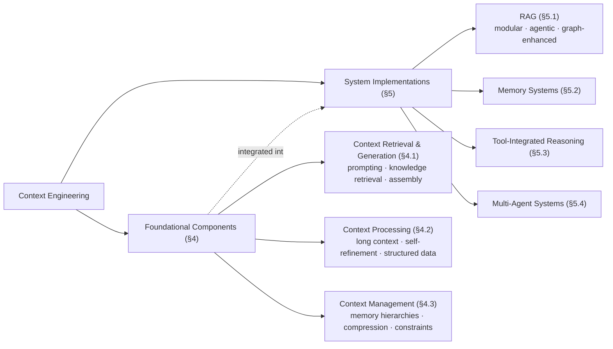

# A Survey of Context Engineering for Large Language Models — Summary

> [!NOTE]
> **Source:** [2507.13334-context-engineering-survey.pdf](../../sources/arXiv/2507.13334-context-engineering-survey.pdf) · Lingrui Mei, Jiayu Yao, Yuyao Ge, Yiwei Wang, Baolong Bi, Yujun Cai, Jiazhi Liu, Mingyu Li, Zhong-Zhi Li, Duzhen Zhang, Chenlin Zhou, Jiayi Mao, Tianze Xia, Jiafeng Guo & Shenghua Liu (Institute of Computing Technology, Chinese Academy of Sciences, et al.), 2025 · arXiv preprint (v2, 21 July 2025) · <https://arxiv.org/abs/2507.13334>.
> Study-guide summary of a 166-page reference survey. Per its scope (1,400+ papers), this summary captures the taxonomy and headline arguments rather than every subsection; see the original for the full catalogue of techniques.

## Abstract

The first comprehensive survey to define **Context Engineering** as a formal discipline — the systematic optimisation of the information payload supplied to an LLM at inference — superseding the narrower craft of prompt design. It organises 1,400+ research papers into a two-level taxonomy: three foundational **Components** (Context Retrieval and Generation; Context Processing; Context Management) that are architecturally integrated into four **System Implementations** (RAG, Memory Systems, Tool-Integrated Reasoning, Multi-Agent Systems).

**Key points**

- **Formal definition:** prompt engineering treats context as a static string (C = prompt); context engineering re-conceptualises it as a dynamically assembled set of components, C = A(c₁,…,cₙ) — instructions, retrieved knowledge, tool definitions, memory, world/agent state, and the user query — and frames the discipline as an optimisation problem: find the context-generating functions F* that maximise expected output quality subject to the context-length constraint |C| ≤ L_max.
- **Three foundational components:** (1) Context Retrieval and Generation (prompt engineering, external knowledge retrieval, dynamic context assembly); (2) Context Processing (long-sequence processing, self-refinement, multimodal and structured/relational integration); (3) Context Management (memory hierarchies, compression, window constraints).
- **Four system implementations** are framed as *architectural integrations* of those components: RAG (modular, agentic, graph-enhanced), Memory Systems, Tool-Integrated Reasoning (function calling, environment interaction), and Multi-Agent Systems (communication protocols, orchestration, coordination).
- **Why it matters:** quadratic attention cost, hallucination, and the "lost-in-the-middle" positional bias (up to 73% degradation) make naive long prompts unreliable, while engineered context delivers documented gains (e.g. zero-shot CoT lifting MultiArith accuracy 17.7%→78.7%; Tree-of-Thoughts lifting Game-of-24 success 4%→74%).
- **The named research gap:** a fundamental **comprehension–generation asymmetry** — models augmented by advanced context engineering understand complex contexts remarkably well but remain poor at *generating* equally sophisticated long-form outputs. The survey calls closing this gap "a defining priority for future research".

**Takeaways**

- Context engineering shifts LLM practice "from the *art* of prompt design to the *science* of information logistics and system optimization" — a systems discipline with measurable objectives, constraints, and debuggable components.
- RAG, memory, tool use, and multi-agent coordination are not separate fields but different assemblies of the same three underlying component classes; the survey's unifying claim is that treating them in isolation has fragmented the literature.
- Evaluation lags far behind capability (e.g. GAIA: humans 92% vs GPT-4 15%), and the field still lacks unified theoretical foundations.

## 1. Introduction

LLM performance is "fundamentally governed by the context they receive". As LLMs became the reasoning core of complex applications, the methods for designing their informational payloads evolved into a formal discipline — but research fragmented into isolated silos (prompting, RAG, memory, tool use, multi-agent systems). The survey's contribution is the first comprehensive, systematic review of the field under a single taxonomy that separates foundational **Components** from their integration into **System Implementations**, providing a technical roadmap for researchers and practitioners.

## 2. Related Work

Prior surveys each cover one vertical — prompt engineering, RAG, long-context methods, LLM agents, tool use, multi-agent systems, evaluation — leaving the connections implicit (RAG as external memory, tool use as context acquisition, prompting as the orchestration language). This survey positions itself as the *horizontal* complement: a unifying abstraction that maps how context is generated, processed, managed, and utilised across all of them.

## 3. Why Context Engineering?

### 3.1 Definition of Context Engineering

Starting from the autoregressive model P_θ(Y|C), prompt engineering historically treated C as a monolithic string. Context engineering redefines C as a structured assembly:

> [!IMPORTANT]
> **C = A(c₁, c₂, …, cₙ)** — context is a dynamically structured set of informational components, sourced, filtered, formatted, and orchestrated by an assembly function A. Context Engineering is the optimisation problem **F\* = arg max_F E_τ [Reward(P_θ(Y|C_F(τ)), Y\*_τ)]** — finding the ideal set of context-generating functions (assembly, retrieval, selection, …) that maximises expected output quality over a task distribution, subject to the hard constraint **|C| ≤ L_max**.

The components map directly onto the survey's taxonomy:

| Component | Content | Survey section |
|---|---|---|
| c_instr | System instructions and rules | §4.1 |
| c_know | External knowledge (RAG, knowledge graphs) | §5.1, §4.2 |
| c_tools | Definitions/signatures of available tools | §5.3 |
| c_mem | Persistent information from prior interactions | §5.2, §4.3 |
| c_state | Dynamic state of user, world, or multi-agent system | §5.4 |
| c_query | The user's immediate request | — |

Deeper mathematical framings: assembly as **dynamic context orchestration** (a pipeline of format/concatenate operations tuned to the model's attention biases); retrieval as **information-theoretic optimality** (select knowledge maximising mutual information with the target answer, not mere semantic similarity); and **Bayesian context inference** (infer the posterior over contexts given query, history, and world state, supporting adaptive retrieval and belief maintenance in multi-step reasoning).

**Prompt engineering vs context engineering** (survey's Table 1):

| Dimension | Prompt Engineering | Context Engineering |
|---|---|---|
| Model | C = prompt (static string) | C = A(c₁,…,cₙ) (dynamic, structured assembly) |
| Target | arg max over a prompt string | System-level optimisation of F = {A, Retrieve, Select, …} |
| Information | Fixed within the prompt | Maximise task-relevant information under \|C\| ≤ L_max |
| State | Primarily stateless | Inherently stateful (explicit c_mem, c_state) |
| Scalability | Brittleness grows with length/complexity | Complexity managed by modular composition |
| Error analysis | Manual inspection and iteration | Systematic evaluation/debugging of individual context functions |

**Context scaling** has two dimensions: *length scaling* (processing ultra-long sequences, thousands→millions of tokens) and *multi-modal and structural scaling* (temporal, spatial, participant-state, intentional, and cultural context beyond plain text) — a shift from parameter scaling toward systems that understand complex, ambiguous contexts.

### 3.2 Why Context Engineering

- **Current limitations.** Self-attention's quadratic compute/memory cost; hallucination, unfaithfulness to input context, and sensitivity to input variations; prompt engineering's subjective, approximation-driven methodology.
- **Performance enhancement.** Documented gains include an 18-fold improvement in text-navigation accuracy and 94% success rates; CoT-style structured prompting; few-shot example selection yielding +9.90% BLEU-4 (code summarisation) and +175.96% exact match (bug fixing); execution-aware debugging frameworks up to +9.8% on code-generation benchmarks.
- **Resource optimisation.** Intelligent content filtering, token-level content selection, and attention steering reduce token consumption while maintaining quality.
- **Future potential.** In-context learning enables task adaptation without retraining, especially valuable in low-resource domains.

## 4. Foundational Components

The three components form a pipeline: **retrieval/generation** sources context, **processing** transforms and optimises it, **management** organises, stores, and compresses it.

### 4.1 Context Retrieval and Generation

- **Prompt engineering and context generation.** The CLEAR framework (conciseness, logic, explicitness, adaptability, reflectiveness); zero-shot and few-shot paradigms (in-context learning is highly sensitive to example selection and ordering). Reasoning frameworks: **Chain-of-Thought** (intermediate reasoning steps; zero-shot CoT's "Let's think step by step" lifts MultiArith accuracy 17.7%→78.7%); **Tree-of-Thoughts** (exploration/lookahead/backtracking; Game of 24 success 4%→74%); **Graph-of-Thoughts** (reasoning as arbitrary graphs; +62% quality and −31% cost vs ToT); self-consistency; ReAct.
- **External knowledge retrieval.** RAG and knowledge-graph integration (e.g. KAPING) ground generation in retrievable, verifiable facts.
- **Dynamic context assembly.** Verbalising structured data; programmatic representations (Python/SQL) outperform natural-language renderings of structured data for complex reasoning; automated prompt optimisation (APE, LM-BFF up to +30% absolute, Promptbreeder's self-referential evolution); Self-Refine (~20% absolute improvement for GPT-4); multi-agent role simulation (+29.9–47.1% relative Pass@1 over single agents).

### 4.2 Context Processing

- **Long context.** Self-attention's O(n²) cost is the bottleneck — extending Mistral-7B from 4K to 128K tokens requires a 122-fold compute increase; Llama 3.1 8B needs up to 16GB per 128K-token request. Remedies: state-space models (Mamba, linear complexity), dilated attention (LongNet, scaling to a billion tokens), linear attention (up to 4000× speedup), FlashAttention (linear memory), Ring Attention (distributed), grouped-query attention, position-interpolation methods (YaRN, LongRoPE reaching 2,048K-token windows, Self-Extend without fine-tuning).
- **Self-refinement and adaptation.** Iterative self-critique and revision (Self-Refine, Reflexion) let models improve outputs over cycles.
- **Multimodal context.** Extending context beyond text to images, audio, video.
- **Relational and structured context.** Knowledge graphs, tables, and databases integrated via verbalisation, structured attention (GraphFormers, QA-GNN); structured knowledge representations improve summarisation by 40% and 14% on public datasets vs unstructured memory.

### 4.3 Context Management

- **Fundamental constraints.** Finite windows; the **"lost-in-the-middle"** phenomenon (models retrieve information at the beginning or end of context far better than the middle), with performance in extended chain-of-thought degrading by as much as 73% vs no prior context; inherent statelessness across interactions; the twin failure modes of *context overflow* (forgetting beyond the window) and *context collapse* (failing to distinguish conversational contexts as windows grow); KV-cache growth as a latency/accuracy bottleneck.
- **Memory hierarchies and storage architectures.** OS-inspired virtual-memory designs — **MemGPT** pages information between the context window ("main memory") and external storage via function calls; PagedAttention manages KV-cache like OS paging; MemoryBank applies the Ebbinghaus forgetting curve to decay memories by time and significance.
- **Context compression.** In-context Autoencoder (ICAE) achieves 4× compression into memory slots; recurrent context compression; hierarchical bi-layer KV caching (ACRE); distributed attention across GPU clusters (Infinite-LLM).

## 5. System Implementations

The four implementations are presented explicitly as integrations of the foundational components into deployable architectures — "how theoretical principles translate into practical systems".

### 5.1 Retrieval-Augmented Generation

Bridges parametric knowledge and dynamic information access.

- **Modular RAG** replaces the linear retrieve-then-generate pipeline with reconfigurable hierarchies (stages → sub-modules → operational units) using routing, scheduling, and fusion (e.g. FlashRAG's 5 modules/16 subcomponents; ComposeRAG's atomic question-decomposition modules).
- **Agentic RAG** embeds autonomous agents in the pipeline: retrieval becomes a dynamic operation guided by reflection, planning, and tool use (Self-RAG's on-demand retrieval with reflection tokens; PlanRAG's plan-then-retrieve; CDF-RAG's closed-loop causal retrieval).
- **Graph-enhanced RAG** retrieves over structured knowledge (GraphRAG's hierarchical indexing with community detection, LightRAG, HippoRAG), supporting multi-hop reasoning and reducing context drift and hallucination through entity interconnectivity.

### 5.2 Memory Systems

Transform stateless models into agents that learn across interactions. Memory is classified temporally (sensory = input prompts; short-term = context window/KV caches; long-term = external stores persisting across sessions) and by implementation (parametric weights, ephemeral activations, plaintext retrieval stores). Short-term memory manifests as in-context learning; long-term implementations span knowledge-organisation, retrieval-oriented, and architecture-driven methods (MemGPT, MemoryBank, MemLLM, A-MEM, MemOS). Evaluation is hampered by a lack of standardised benchmarks and by memory–reasoning entanglement; commercial assistants show accuracy drops of up to 30% in sustained interactions.

### 5.3 Tool-Integrated Reasoning

Turns LLMs "from text generators into world interactors".

- **Function calling** evolved from Toolformer's self-supervised API learning through ReAct's thought–action–observation cycle to specialised models (Gorilla, ToolLLM, Granite-FunctionCalling) and OpenAI's JSON standardisation. The core loop: intent recognition → function selection → parameter mapping → execution → response generation.
- **Training and data.** Fine-tuning (stable but costly) vs prompting (flexible but unstable); synthetic data pipelines such as APIGen (60,000+ verified entries across thousands of APIs).
- **Benchmarks:** API-Bank (73 APIs, 314 dialogues), StableToolBench, NesTools, ToolHop (995 queries, 3,912 tools).

### 5.4 Multi-Agent Systems

Called "the pinnacle of collaborative intelligence" and of context engineering.

- **Communication protocols.** Lineage from 1990s agent communication languages (KQML, FIPA ACL) to the contemporary LLM-agent protocol stack: **MCP** ("USB-C for AI", JSON-RPC agent–environment interface), **A2A** (peer-to-peer capability-based Agent Cards), **ACP** (RESTful messaging), **ANP** (open-internet interoperability via W3C DIDs) — a progressive layering from tool access to network interoperability. Frameworks: AutoGen, MetaGPT, CAMEL, CrewAI.
- **Orchestration.** A-priori vs posterior agent selection (3S orchestrator), function-based and component-based orchestration, emergent puppeteer-style and serialized paradigms; context is the foundational element (global state, session-scoped refinement).
- **Coordination challenges.** Current frameworks (LangGraph, AutoGen, CAMEL) lack transactional integrity — no atomicity guarantees or compensation for partial failures — and over-rely on LLM self-validation; SagaLLM adds transaction support and independent validation. Automated orchestration outperforms humans at selecting agents.

## 6. Evaluation

Context-engineered systems outstrip traditional assessment: static metrics (BLEU, ROUGE, perplexity) cannot capture multi-step, multi-component behaviour, and component interdependencies make failure attribution intractable. Headline findings:

- **GAIA benchmark:** humans achieve 92% on general-assistant tasks vs 15% for GPT-4 — the survey's emblem of the capability gap and of inadequate frameworks.
- Memory evaluation suffers an isolation problem (stages can't be separated) and sustained-interaction degradation (up to 30% accuracy drops).
- Emerging paradigms: self-refinement evaluation across iteration cycles, multi-aspect feedback, criticism-guided evaluation, orchestration/transactional-integrity assessment, and safety-oriented evaluation of autonomous agentic systems, moving toward "living benchmarks" that co-evolve with capabilities.

## 7. Future Directions and Open Challenges

- **Theoretical foundations.** The field "currently operates without unified theoretical foundations" — no mathematical framework for optimal context composition, information-theoretic bounds on context efficiency, or compositional models of component interaction.
- **The comprehension–generation asymmetry** (§7.1.2): "the fundamental asymmetry between LLMs' remarkable comprehension capabilities and their pronounced generation limitations represents one of the most critical challenges in Context Engineering research" — manifesting in long-form coherence, factual-consistency maintenance, and planning sophistication; it is unknown whether the cause is architectural, training-methodological, or a fundamental computational boundary.
- **Technical innovation.** Next-generation architectures beyond O(n²) attention (SSMs like Mamba), intelligent context assembly and optimisation, graph-problem solving.
- **Application-driven research.** Domain specialisation; large-scale multi-agent coordination (protocol standardisation across MCP/A2A/ACP/ANP, with unresolved security vulnerabilities); **human–AI collaboration** — hybrid teams need research on task allocation, shared mental models, and trust calibration; web-agent benchmarks (WebArena, Mind2Web) show current systems struggle with sustained multi-step collaboration, and systems must learn to communicate their own limitations.
- **Deployment and society.** Production scalability under O(n²) limits; fault tolerance and transactional integrity; safety and security (prompt injection, data poisoning, protocol vulnerabilities); alignment under dynamic adaptation; bias, privacy (persistent memory raises leakage risks, needing selective forgetting), and transparency.

## 8. Conclusion

The survey establishes Context Engineering as a formal discipline through analysis of 1,400+ papers, with the unified taxonomy (three Foundational Components; four System Implementations) as its primary contribution. Three key insights: (1) the **comprehension–generation gap** is the field's most critical challenge; (2) techniques increasingly combine **synergistically**, creating capabilities exceeding their components; (3) there is a clear trend toward **modularity and compositionality**. Evaluation methodologies remain insufficient for adaptive, multi-component, long-horizon systems. The closing claim: because AI performance is fundamentally determined by contextual information, context engineering will remain central to AI development — a distinct discipline with its own principles, methodologies, and challenges.
