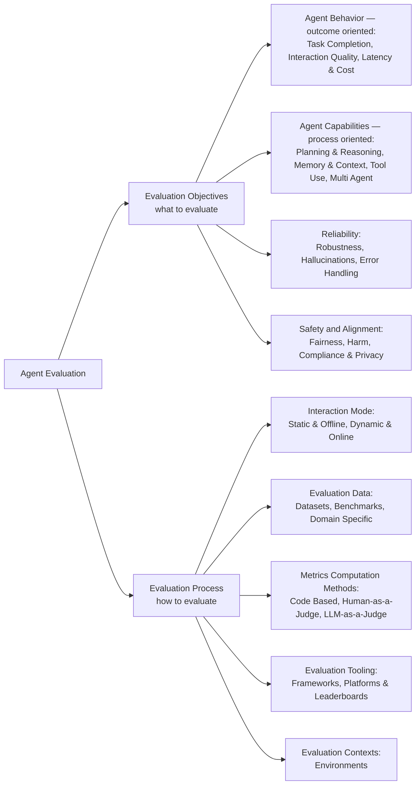

# Evaluation and Benchmarking of LLM Agents: A Survey — Summary

> [!NOTE]
> **Source:** [2507.21504-agent-benchmarking-survey-kdd.pdf](../../sources/arXiv/2507.21504-agent-benchmarking-survey-kdd.pdf) · Mahmoud Mohammadi, Yipeng Li, Jane Lo & Wendy Yip (SAP Labs), 2025 · KDD '25 (31st ACM SIGKDD Conference on Knowledge Discovery and Data Mining V.2, Toronto), doi:10.1145/3711896.3736570 · [arXiv:2507.21504](https://arxiv.org/abs/2507.21504).
> Study-guide summary of the full document. See the original for exact wording and figures.

## Abstract

An 11-page KDD 2025 survey from four SAP Labs researchers that organises the fragmented field of LLM-agent evaluation into a **two-dimensional taxonomy** — *evaluation objectives* (what to evaluate) crossed with *evaluation process* (how to evaluate) — and adds an enterprise-deployment lens that academic benchmark surveys largely omit.

**Key points**

- **Agent evaluation is not LLM evaluation.** LLMs are assessed on text generation and QA; agents reason, plan, execute tools, use memory, and collaborate in dynamic, interactive environments. The paper's analogy: LLM evaluation examines an engine; agent evaluation road-tests the whole car under varied driving conditions. Agent evaluation also differs from traditional software testing, which assumes deterministic, static behaviour where agents are probabilistic and dynamic.
- **Dimension 1 — Evaluation Objectives (what):** four categories — *Agent Behavior* (outcome-oriented: task completion, output quality, latency and cost), *Agent Capabilities* (process-oriented: tool use, planning and reasoning, memory/context retention, multi-agent collaboration), *Reliability* (consistency across repeated runs, robustness under perturbation and errors), and *Safety and Alignment* (fairness, harm/toxicity/bias, compliance and privacy).
- **Dimension 2 — Evaluation Process (how):** five categories — *Interaction Mode* (static/offline vs dynamic/online), *Evaluation Data* (datasets, benchmarks, domain-specific), *Metrics Computation Methods* (code-based, LLM-as-a-Judge, human-in-the-loop), *Evaluation Tooling* (frameworks, platforms, leaderboards), and *Evaluation Contexts* (mocked/sandbox through live environments).
- **Enterprise-specific challenges** rarely addressed in current research: role-based access control (agents must inherit the user's permissions), reliability guarantees for audit/compliance (pass^k over pass@k), dynamic long-horizon interactions (600-turn dialogues, multi-day simulations), and adherence to domain policies and regulation (GDPR, HIPAA, approval workflows) — an agent "correct" on traditional benchmarks can still fail in production on policy violations.
- **Positioning:** the authors argue existing surveys focus narrowly on LLM evaluation or on single agent capabilities without a holistic perspective, and that enterprise requirements (secure data access, auditability, complex interaction patterns) are rarely addressed in the literature.

**Takeaways**

- Use the grid as a checklist: pick objectives (behaviour, capability, reliability, safety) and, for each, choose the process (mode, data, metric method, tooling, context) that matches the deployment's stakes.
- Occasional success is insufficient for production: consistency requires repeated trials (τ-bench's pass^k), and current agents struggle with it even in retail and airline-booking domains.
- Evaluation is becoming continuous rather than one-off — Evaluation-driven Development (EDD) and AgentOps monitor agents through development and deployment.
- Future work the authors call for: holistic multi-dimension frameworks, more realistic (enterprise-like) settings, automated and scalable techniques (LLM/Agent-as-a-judge, synthetic data), and time- and cost-bounded protocols.

## 1 Introduction

- LLM-based agents — autonomous or semi-autonomous systems that use LLMs to reason, plan, and act — are moving from research prototypes to real-world applications (customer-service bots, coding copilots, digital assistants), making rigorous evaluation pressing and complex.
- **Why standard LLM evaluation is insufficient:** agents operate in dynamic, interactive environments — they reason and plan, execute tools, leverage memory, and collaborate with humans or other agents. The paper's analogy: LLM evaluation is like examining an engine's performance; agent evaluation assesses the whole car under various driving conditions.
- **Why software testing is insufficient:** software testing targets deterministic, static behaviour; LLM agents are inherently probabilistic and dynamic. Agent evaluation sits at the intersection of NLP, HCI, and software engineering.
- **Gap claimed:** existing surveys focus narrowly on LLM evaluation or cover specific agent capabilities without a holistic perspective; enterprise applications add requirements — secure access to data and systems, high reliability for audit and compliance, more complex interaction patterns — rarely addressed in existing literature.
- **Two contributions:** (1) a taxonomy organising prior work by evaluation objectives and evaluation process; (2) a treatment of enterprise-specific challenges (role-based access control, reliability guarantees, long-term interaction, compliance).

## 2 Taxonomy for LLM-based Agent Evaluation

The two-dimensional taxonomy (the paper's Figure 1), recreated here:

- **Evaluation Objectives** (targets): *Agent Behavior* is outcome-oriented — did the agent produce the right result, efficiently and affordably, as end-users perceive it. *Agent Capabilities* is process-oriented — does the agent produce results the right way, as designed (tool use, planning/reasoning, memory, collaboration). *Reliability* — consistent for the same input, robust when input varies or errors occur. *Safety and Alignment* — trustworthiness and security, including fairness, compliance, and prevention of harmful or unethical behaviour.
- **Evaluation Process** (methods): *Interaction Mode* — static fixed-input evaluation vs interactive engagement. *Evaluation Data* — synthetic and real-world datasets, plus domain benchmarks (software engineering, healthcare, finance). *Metrics Computation Methods* — quantitative measures and qualitative human/LLM judgments. *Evaluation Tooling* — instrumentation frameworks (LangSmith, Arize AI) and leaderboards (Holistic Evaluation of Agents). *Evaluation Contexts* — controlled simulations through open-world settings (web browsers, APIs).
- The taxonomy is offered as both conceptual framework and practical guide; single-turn vs multi-turn, multilingualism, and multimodality require tailored metrics but fit within it.

## 3 Evaluation Objectives

### 3.1 Agent Behavior

Black-box, user-perceived performance — the highest-level view: task completion, output quality, latency, cost.

- **Task completion (3.1.1):** whether the agent reaches the desired state or meets defined success criteria. Metrics: **Success Rate (SR)** (also Task Success Rate, Overall Success Rate), **Task Goal Completion (TGC)**, **Pass Rate**, binary 0/1 reward functions, and **pass@k / pass^k** over multiple trials. Noted limitation: coarse — little fine-grained insight into failures, especially when most models score low. Applied across coding/software engineering (SWE-bench GitHub-issue resolution, ScienceAgentBench scientific data analysis, CORE-Bench and PaperBench research reproduction, AppWorld interactive app coding) and web environments (BrowserGym, WebArena, WebCanvas; multimodal VisualWebArena, MMInA; realistic long tasks ASSISTANTBENCH).
- **Output quality (3.1.2):** umbrella for accuracy, relevance, clarity, coherence, adherence to specifications — an agent can complete the task yet deliver a subpar experience. Overlaps with LLM metrics (fluency, logical coherence) and RAG metrics (Response Relevance, Factual Correctness). Especially relevant for conversational agents with multi-turn goals.
- **Latency and cost (3.1.3):** **Time To First Token (TTFT)** for synchronous streaming; **End-to-End Request Latency** for asynchronous use. Cost — not user-visible but decisive for deployment at scale — is estimated from input/output token counts under usage-based pricing.

### 3.2 Agent Capabilities

Process-oriented competencies that explain *how* behaviour is achieved, at a more granular level.

- **Tool use (3.2.1):** single-tool invocation (interchangeable with function calling; sequences belong to planning). Key questions: does the agent know *whether* to invoke a tool, *which* to select, and can it name and fill *parameters* correctly — plus retrieving the right tool from a large repository. Metrics: **Invocation Accuracy**, **Tool Selection Accuracy**, **Retrieval Accuracy** (rank-k), **MRR**, **NDCG**, **parameter-name F1**. AST-based syntactic checks can miss semantic errors (hallucinated parameter values, enum violations); the Gorilla paper proposed **execution-based evaluation** — actually running tool calls and assessing outcomes.
- **Planning and reasoning (3.2.2):** planning = selecting the right tools in the right order; reasoning = context-aware decisions ahead of time or during execution. T-eval compares predicted tool sets to a reference; graph-based benchmarks use **Node F1** (tool selection) and **Edge F1 / Normalized Edit Distance** (invocation sequences and structure). For interleaved planning–execution (the ReAct paradigm), T-Eval scores how closely each predicted next tool call matches the expected one; AgentBoard's **Progress Rate** compares actual vs expected trajectory. When plans are generated as multi-step programs, code-generation methods apply: ScienceAgentBench uses program-similarity metrics; **Step Success Rate** measures the share of plan steps successfully executed.
- **Memory and context retention (3.2.3):** Guan et al. categorise memory evaluation by **Memory Span** (how long information is stored) and **Memory Forms** (how represented). LongEval and SocialBench test retention over long dialogues (40+ turns); Maharana et al. reach 600+ turns; Li et al. track long-horizon consistency. Metrics: **Factual Recall Accuracy**, **Consistency Score** (no contradictions between turns); also working memory for tool users (tracking intermediate results) and forgetting strategies (discarding irrelevant detail).
- **Multi-agent collaboration (3.2.4):** LLM agents coordinate via natural language, strategic reasoning, and decentralised problem-solving rather than predefined RL reward structures — relevant to financial decision-making and structured data analysis. Autonomous Agents for Collaborative Tasks evaluates **Collaborative Efficiency** (dynamic responsibility-sharing and task distribution).

### 3.3 Reliability

Probes worst-case and average-case rather than best-case capability — crucial for enterprise and safety-critical use.

- **Consistency (3.3.1):** output stability when the same task is repeated; LLMs are non-deterministic, so agents vary run to run. **pass@k** (succeeds at least once in k) is common, but the stricter **pass^k** (succeeds in *all* k attempts), formalised in the τ-benchmark, better captures mission-critical consistency requirements.
- **Robustness (3.3.2):** stability under input variation or environment change. Stress tests perturb inputs — paraphrases, irrelevant/misleading context, typos, dialects — and measure the drop in success rate or quality (HELM tracks degradation under input variation). Also **adaptive resilience**: WebLinX examines agents when a web page's structure changes mid-execution. For tool users, error handling: ToolEmu-style evaluations inject failures (API errors, null responses) and check whether the agent recovers (retries, switches tools, explains the issue) — a candidate metric is the proportion of induced failures handled appropriately.

### 3.4 Safety and Alignment

Adherence to ethical guidelines, avoidance of harm, compliance with legal/policy constraints — critical in financial services, cybersecurity, and autonomous decision-making.

- **Fairness (3.4.1):** biased decisions (e.g. loan approvals, investment strategies — FinCon, AutoGuide) can reinforce systemic inequalities; multi-agent frameworks must comply with standards and social norms. Explainability builds trust: guideline-driven decision-making (AutoGuide), structured transparency (MATSA, FinCon), and R-judge's analysis of how agents perceive risk in autonomous decisions.
- **Harm, toxicity, and bias (3.4.2):** specialised test sets — RealToxicityPrompts (prompts likely to elicit toxic content, scored by automated detectors or human raters); HELM includes toxicity and bias metrics. Red-teaming with provocative inputs measures unsafe-response failure rates. **CoSafe** targets multi-turn adversarial prompts and revealed that even advanced agents fall for coreference-based attacks (ambiguous references used to bypass filters); safety is quantified as the percentage of adversarial cases producing a disallowed response.
- **Compliance and privacy (3.4.3):** domain-specific constraints — a finance chatbot must not disclose confidential information; a medical assistant must refuse prescription-only recommendations and advise seeing a doctor. Enterprise compliance evaluation may need proprietary test cases reflecting actual policies; an enterprise HELM variant adds domain prompts and metrics (financial jargon accuracy, compliant responses) for finance and law; **TheAgentCompany** evaluates enterprise agents under structured correctness constraints requiring adherence to predefined organisational policies.

### Table 1 — Objectives, metrics, and representative benchmarks (condensed from the paper's Table 1)

| Objective | Category | Representative metrics | Representative papers/benchmarks |
|---|---|---|---|
| Agent Behavior | Task Completion | Success Rate, F1, Pass@k, Progress Rate, Execution Accuracy | AgentBoard, WebShop, AgentBench, AppWorld, TheAgentCompany, SWE-bench, Mobile-Env |
| Agent Behavior | Output Quality | Coherence, User Satisfaction, Usability, Likability | PredictingIQ, EnDex, PsychoGAT |
| Agent Behavior | Latency & Cost | Latency, Token Usage, Cost | MobileBench, MobileAgentBench, WebArena, GUI Agents, Spa-bench |
| Agent Capability | Tool Use | Task Completion Rate, Tool Selection Accuracy | ToolEmu, MetaTool, AutoCodeRover |
| Agent Capability | Planning & Reasoning | Reasoning Quality, Fine-Grained Progress Rate, Self-Consistency, Plan Quality | AgentBoard, MMLU, SimuCourt, Magis |
| Agent Capability | Memory & Context | Factual Accuracy Recall, Consistency Scores | LongEval, SocialBench, LoCoMo, Optimus-1 |
| Agent Capability | Multi-Agent Collaboration | Information Sharing Effectiveness, Adaptive Role Switching | AgentSims, WebArena, MATSA, GAMEBENCH, BALROG |
| Reliability | Consistency | pass^k | τ-Bench |
| Reliability | Robustness | Accuracy / Task Success Rate under perturbation | HELM, WebLinX |
| Safety | Fairness | Awareness Coverage, Violation Rate, Transparency, Ethics | CASA, R-Judge, SimuCourt, MATSA, FinCon, AutoGuide |
| Safety | Harm | Adversarial Robustness, Prompt-Injection Resistance, Harmfulness, Bias Detection | Agent Security Bench, AgentPoison, AgentDojo, SafeAgentBench, AgentHarm, RealToxicityPrompts |
| Safety | Compliance & Privacy | Risk Awareness, Task Completion Under Constraints | R-Judge, Cybench, TheAgentCompany |

## 4 Evaluation Process

### 4.1 Interaction Mode

- **Static & offline (4.1.1):** baseline evaluation on pre-generated datasets and static test cases (task/prompt/conversation collections). Cheaper and simpler to run and maintain, but lacks nuance for the range of agent responses, is more prone to error propagation, and represents system performance less accurately.
- **Dynamic & online (4.1.2):** typically post-deployment, using simulations or real user interactions — adaptive data rich in domain context that static testing misses. Proxies can simulate users or environments reactively in real time; web simulators (MiniWoB, WebShop, WebArena) verify correct action sequences (clicks, form-fills).
- **Evaluation-driven Development (EDD):** makes evaluation integral to the agent development cycle — continuous offline (during development) and online (after deployment) evaluation to detect regressions and adapt; a reference architecture puts an **AgentOps** component monitoring production performance and feeding insights back to developers. Evaluation is an ongoing process, not a one-time task.

### 4.2 Evaluation Data

- Built from mixes of human-annotated, synthetic, and interaction-generated data. Expert-labelled structured benchmarks: **AAAR-1.0**, **ScienceAgentBench**, **TaskBench** (research reasoning, scientific workflows, multi-tool planning). Tool-use/function-calling over large API repositories: **FlowBench**, **ToolBench**, **API-Bank** — typically including gold tool sequences *and* expected parameter structures for fine-grained evaluation.
- Open-ended interactive benchmarks: **AssistantBench**, **AppWorld**, **WebArena** — dynamic decision-making, long-horizon planning, user–agent interaction. Safety/robustness benchmarks: **AgentHarm** (harmful behaviours), **AgentDojo** (prompt-injection resilience).
- Leaderboards consolidate: **Berkeley Function-Calling Leaderboard (BFCL)** and **Holistic Agent Leaderboard (HAL)** provide standardised test cases, automated metrics (AST correctness, Win Rate), and rankings.

### 4.3 Metrics Computation Methods

| Method | How it works | Strengths | Weaknesses |
|---|---|---|---|
| **Code-based** | Explicit rules, test cases, assertions verify responses against predefined criteria | Most deterministic and objective; consistent, reproducible — ideal for well-defined outputs (calculations, structured queries, program syntax) | Inflexible; struggles with open-ended/qualitative responses where correctness is subjective |
| **LLM-as-a-Judge** | An LLM scores responses against instructed qualitative criteria; **Agent-as-a-Judge** extends it with multiple interacting AI agents refining the assessment | Handles subjective, nuanced tasks (summarisation, reasoning, conversation); highly scalable and adaptable | (Reliability concerns motivate the Agent-as-a-Judge extension) |
| **Human-in-the-loop** | User studies, expert audits, crowdworker annotations (relevance, correctness, tone) | Gold standard for subjective aspects (naturalness, satisfaction) and safety-critical judgment calls; highest reliability on open-ended tasks | Expensive, time-consuming, hard to scale; impractical for frequent large-scale automated evaluation |

### 4.4 Evaluation Tooling

- Frameworks and platforms supporting automated, scalable, continuous evaluation workflows, integrating evaluation into the development lifecycle (the EDD movement). **OpenAI Evals** (open-source task/metric specification and automated reporting); **DeepEval**, **InspectAI** (UK AI Security Institute), **Phoenix** (Arize), **Galileo** (analytics, orchestration, debugging).
- Agent development platforms increasingly embed evaluation: **Azure AI Foundry**, **Google Vertex AI** (the paper prints "Vortex AI"; its reference links to Vertex AI), **LangGraph**, **Amazon Bedrock** — monitoring performance, detecting regressions, adapting to evolving needs. Xia et al.'s **AgentOps** architecture continuously monitors deployed agents, closing the development–deployment loop with real-time feedback and quality control.

### 4.5 Evaluation Contexts

- The environment in which evaluation runs; as in software engineering, a trade-off between **realistic** (costlier, potentially less secure) and **controlled** (simpler but less representative of final performance) environments.
- Choice is guided by intended use: a simple agent without edit access can be tested in its working environment directly; an agent that changes many intertwined systems is evaluated in a mocked-API or sandbox environment; less contained systems use web simulators (MiniWoB, WebShop, WebArena).
- The context typically evolves with the agent — from small mocked-API environments toward live deployment as performance and trustworthiness are established.

## 5 Enterprise-Specific Challenges

Enterprises demand high performance *plus* predictable reliability, regulatory compliance, data security, and maintainability — usually overlooked during evaluation.

- **Complexity from role-based access (5.1):** Role-Based Access Control (RBAC) means an agent acting on a user's behalf must inherit that user's permission constraints — the agent's ability to retrieve or act on information is contextually bound to the user's role, not uniform. **IntellAgent** embeds this: evaluation tasks require identity authentication and enforce policies denying access to other users' information, modelling permission-sensitive enterprise contexts.
- **Reliability guarantees (5.2):** compliance and auditing frameworks require deterministic or repeatable, explainable behaviour; occasional success is insufficient for production-readiness. Measuring consistency means executing the same task multiple times — significant evaluation overhead, especially for tasks involving tools, memory, or multi-agent coordination — over a representative dataset. The **τ-benchmark**'s pass^k applied to retail and airline-booking domains shows current agents struggle with consistency.
- **Dynamic and long-horizon interactions (5.3):** most benchmarks cover short episodes, but real enterprise agents operate continuously over extended periods; short-term evaluation cannot capture performance drift, context retention, or the cumulative effect of decisions on business outcomes. Early tools: Park et al.'s generative agents observed across multi-day interactions in a continuously running simulated town; Maharana et al.'s 600-turn dialogues testing long-term conversational memory and coherence.
- **Domain-specific policies and compliance (5.4):** enterprises enforce approval workflows, data-retention policies, usage quotas, and regulations such as GDPR and HIPAA. Evaluation must verify behavioural alignment with formal policy and legal constraints, not just task success — e.g. an agent generating financial reports must avoid unauthorised access to confidential forecasts and meet regulatory reporting standards. Without explicit modelling of these constraints, agents deemed "correct" on traditional benchmarks may still fail in production on policy violations or compliance risk.

## 6 Future Research Directions

- **Holistic evaluation frameworks:** current efforts isolate single dimensions (task success, planning quality, tool use); real agents must balance multiple interdependent competencies simultaneously.
- **More realistic evaluation settings:** bridge lab-to-production gaps with enterprise elements — dynamic multi-user interactions, role-based access controls, domain knowledge — via real-world deployment trials or simulated enterprise workflows.
- **Automated and scalable techniques:** manual evaluation of multi-turn/long-horizon behaviour is costly; pursue synthetic data generation for controllable test cases, simulated environments, and LLM-as-a-judge / Agent-as-a-judge.
- **Time- and cost-bounded protocols:** repeated trials and human-in-the-loop assessment are time- and resource-intensive; develop protocols balancing depth against efficiency to support iterative development.

The authors' summary: future evaluation methods must be **holistic, realistic, scalable, and efficient** to build reliable and trustworthy LLM-based agents at scale.
