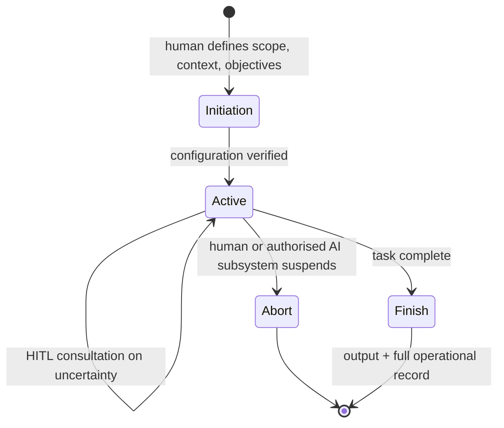

# Toward Safe and Responsible AI Agents: A Three-Pillar Model for Transparency, Accountability, and Trustworthiness — Summary

> [!NOTE]
> **Source:** [2601.06223-safe-responsible-ai-agents.pdf](../../sources/arXiv/2601.06223-safe-responsible-ai-agents.pdf) · Edward C. Cheng (Stanford), Jeshua Cheng (Inquiryon), and Alice Siu (Stanford), 2026 · arXiv:2601.06223v1 [cs.CY], 9 Jan 2026 · <https://arxiv.org/abs/2601.06223>. No peer-reviewed venue printed on the paper.
> Study-guide summary of the full document. See the original for exact wording and figures.

## Abstract

A conceptual and operational framework — the **Three-Pillar Model (3PM)** of **Transparency, Accountability, and Trustworthiness** — for developing, deploying, and operating safe AI agents, arguing that agent autonomy must be *earned* through progressive, evidence-based validation (by analogy with autonomous driving) rather than granted by design. Transparency and accountability are positioned as the foundations of user trust and as mitigations for known generative-AI risks — hallucinations, data bias, and goal misalignment (including what the authors call the "inversion problem").

**Key points**

- **Four evolutionary stages of AI agency:** Assisted Agents → Collaborative Agents → Supervised Autonomy → Full Autonomy with Human Governance. Advancement between stages must be validated by measured evidence of safety, predictability, and alignment — and each increase in autonomy must be explicitly approved by a human authority and documented.
- **Pillar 1, Transparency** — visibility across the agent lifecycle (initiation → active → abort/finish), backed by three minimum record types: state-transition records, work-progress records, and HITL records of every human–AI interaction.
- **Pillar 2, Accountability** — "transparency answers *what* happened, accountability answers *why* it happened and *who* is responsible." Achieved through **decision journaling** that records the reasoning, data sources, constraints, and confidence behind each decision (human or AI), so that responsibility for any outcome can be traced to its source across the whole human+AI workflow.
- **Pillar 3, Trustworthiness** — converts the first two pillars into calibrated confidence: risk thresholds and escalation rules trigger human review for high-risk actions; fallback/recovery mechanisms halt failures before they propagate; trust is mutual (humans trust bounded agents; agents defer to validated human input).
- **Pillar interaction:** a layered feedback ecosystem — transparency provides the data for accountability; accountability identifies what to improve; trustworthiness motivates greater delegation of control. The dominant pillar shifts with the autonomy stage: transparency early, accountability in the collaborative middle, trustworthiness late.
- Three work streams operationalise the model: public deliberative forums via the **Stanford Deliberative Democracy Lab** (North America and India), industry guidelines via the **Safe AI Agent Consortium** (members include Anthropic, Cohere, DoorDash, Meta, Microsoft, Oracle, PayPal, Stanford), and open tooling for a 3PM-aligned **agent operating environment** interoperable with MCP, A2A, ACP, and ANP.

**Takeaways**

- The paper is best read as a **governance/policy-oriented position paper with an operational sketch**, not an engineering paper: it is filed under cs.CY (Computers and Society), presents no experiments, benchmarks, or system evaluation, and two of its three work streams are governance activities (public deliberation and industry standard-setting). The "engineering" content is a described-and-illustrated reference design (activity logs, decision journals, oversight UI, dashboards) plus *proposed* open-source tooling.
- Its distinctive contribution is making accountability *procedural*: allocation of responsibility is not assigned in advance to a party but reconstructed after the fact from mandatory decision journals covering every participant — human and AI — in the workflow.
- The staged-autonomy argument gives a usable governance rule: reduce human oversight only on measurable evidence of reliability, with explicit human sign-off and periodic spot checks even after autonomy increases.

## I. Introduction

AI agents extend generative AI from text generation into **real-world action** — executing tasks, reasoning over goals, and deciding on behalf of humans (transferring funds, filing prescriptions, drafting contracts, guiding robots). This unlocks economic value but multiplies the risks of error, bias, and misalignment; failures can cause financial loss, privacy breaches, or physical harm, arising from training bias, missing situational context, hallucinated reasoning, or intent–objective misalignment. The paper frames the field's urgent challenge as ensuring safe, transparent, accountable agents, and reads the literature as a growing consensus that **human–AI collaboration, not full automation**, is the most promising path. It groups prior work into three thematic clusters:

### A. Foundational Theories of Human-in-the-Loop AI

- **Zanzotto (2019)** — *Human-in-the-loop Artificial Intelligence (HitAI)*: humans are not mere annotators but the original "knowledge producers" who must remain central to both credit and control.
- **Wu et al. (2022)** — systematic survey of HITL for machine learning as a data-centric methodology; human involvement improves labelling efficiency, interpretability, and robustness.
- **Mosqueira-Rey et al. (2023)** — unifying taxonomy of HITL-ML paradigms (Active Learning, Interactive ML, Machine Teaching, Curriculum Learning, Explainable AI); human–AI relationships sit on a **continuum of control**, redefining HITL as *shared agency* rather than supervision.
- **MIT Sloan "AI Alignment" management paradigm** (Wixom, Someh & Gregory) — accuracy, real-world reliability, and stakeholder relevance require continuous human engagement; a companion MIT Sloan study finds asking critical safety questions early prevents systemic errors and security vulnerabilities.

### B. Operational Frameworks for Safe and Collaborative AI Agents

- **Bellos and Siskind (2025)** — evaluation framework, multimodal dataset, and an AR assistive agent for physical tasks (cooking, battlefield medicine); interactive guidance improves task success and reduces procedural errors, and exposure improves *subsequent unassisted* human performance — agents as collaborative partners and skill-builders.
- **Mozannar et al. (2025)** — **Magentic-UI** (built on Microsoft's Magentic-One): open-source HITL agent platform supporting co-planning, co-tasking, action approval, and answer verification — safety and transparency designed into interfaces and orchestration.

### C. Emerging Approaches for Uncertainty-Aware and Human-Governed AI Agents

- **Retzlaff et al. (2024)** — survey of HITL reinforcement learning; RL inherently depends on human feedback; design requirements include feedback quality, trust calibration, and explainability for moving from human-*guided* to human-*governed* learning.
- **Ren et al. (2023)** — **KNOWNO** ("Know When You Don't Know"): conformal prediction quantifies an LLM robot planner's uncertainty so it requests human help below a safety threshold, with formal statistical guarantees on task success while minimising unnecessary intervention.
- **Allen et al. (2024, Harvard)** — "power-sharing liberalism" model of AI governance with **six core governance tasks**: mitigating harm, managing emergent capabilities, preventing misuse, advancing public benefit, building human capital, strengthening democratic capacity. **Barroso and Mello (2024)** call for global governance grounded in human dignity, transparency, accountability, and democratic oversight.
- **Natarajan et al. (2025, AAAI-25)** — the **AI-in-the-Loop (AI2L)** reframing: many systems labelled HITL are really AI2L, where the *human* remains the decision-maker; a philosophical shift "from human-assisted AI to AI-assisted humanity."

### D. Toward a Framework for Safe, Transparent AI Agents

The trajectory runs from ethical advocacy, to engineered collaboration, to formal mechanisms for uncertainty and governance — but methodologies and evaluation metrics remain fragmented. This paper synthesises HITL, AI2L, uncertainty alignment, and human-governed learning into one framework aimed at agents that are "transparent by design, collaborative by nature, and accountable in operation."

## II. The Evolution Path Towards Autonomous Agents

*(The PDF's section numbering restarts at "I." several times; numbering here follows reading order.)*

Full autonomy "cannot be realized in a single leap" — human involvement is reduced only as confidence grows through proven safety, reliability, and accountability.

### A. Lessons from Autonomous Driving

Driver-assist systems (adaptive cruise control, lane keeping) began by assisting, not replacing, judgment — foot on pedal, hands on wheel, eyes on road. Capability grew gradually (automatic parking, highway lane changes), letting engineers find edge cases and letting **societal trust grow incrementally**, with each improvement accompanied by clear communication of limits. Only this patient process approached Level 4/5 autonomy. The success factors: transparency, communication of system limits, and clear accountability — not technology alone.

### B. Parallels in AI Agents Development

Like early autonomous vehicles required attentive drivers, current agents depend on HITL oversight. Human involvement is both safeguard and source of learning — "a critical step in the learning and governance process," not administrative overhead (citing Wu 2022, Mosqueira-Rey 2023, Retzlaff 2024).

### C. HITL as a Mechanism for Trust and Safety

Oversight matters most in the intermediate stages, when agents reason capably but lack contextual, ethical, and situational awareness. HITL lets humans validate outputs, correct errors, and prevent harm from hallucinations, data bias, or wrong assumptions. Human intervention may be reduced as reliability is demonstrated — but **"based on measurable improvements, not assumption."** This is especially binding in trust-sensitive, regulated domains: finance, HR, healthcare, legal.

### D. A Collaborative Path Toward Full Autonomy

Progress is simultaneously technological (enabling independence) and social (acceptance depends on observable safety and accountability). The paper defines **four evolutionary stages of AI agency**:

| Stage | Division of labour |
|---|---|
| **1. Assisted Agents** | Humans decide; AI supports with recommendations and reasoning |
| **2. Collaborative Agents** | Humans and AI share decision-making and execution; human participation enriches situational/semantic context so actions stay aligned with intent and real-world constraints |
| **3. Supervised Autonomy** | AI operates independently in constrained environments, accountable through human review |
| **4. Full Autonomy with Human Governance** | AI functions independently within transparent, auditable frameworks preserving human oversight at the *policy* level |

Advancement must be validated by evidence of safety, predictability, and alignment; skipping stages risks premature deployment and loss of confidence. Autonomy "cannot be declared by design; it must be demonstrated through experience and data." AI agents may mature faster than cars did (faster digital feedback loops, lower physical risk), but under the same principles.

## III. A Three-Pillar Model for a Safe AI-Agent Operating Environment

Agents must operate inside a **structured environment** built for growth, supervision, and accountability; otherwise autonomous evolution is uncontrolled and exposes organisations to unacceptable risk. The **Three-Pillar Model (3PM)** defines that environment:

1. **Transparency of AI Agents** — visibility into how agents operate across their lifecycles.
2. **Accountability in Decision-Making** — mechanisms to attribute and explain decisions made by both humans and AI.
3. **Trustworthiness through Human-AI Collaboration** — confidence via well-timed human oversight and fallback safeguards.

### A. Pillar One: Transparency and Building Trust with AI

Transparency lets operators know **how the agent works, what it is doing, and why**. Every agent instance passes through a lifecycle (Figure 2 shows the state-transition diagram):

- **Initiation** — a human defines scope, context, and objectives (e.g. a Research Agent gets market segments, data sources, success criteria); a control point where configurations, roles, and constraints are verified before operation.
- **Active** — the agent works (research, payments, drafting collection letters); the environment must automatically generate **activity journals** of decisions, interactions, and results. HITL handoffs occur when the agent hits uncertainty; involvement ranges from direct supervision to collaborative decision-making to minimal observation, scaled by task complexity and risk.
- **Abort** — both human operators *and authorised AI subsystems* can abort/suspend an agent (missing resources, time constraints, safety violations); abort authority follows defined governance rules reflecting contractual and regulatory conditions.
- **Finish** — clear output plus a record of the entire operation.

**Three minimum record types** (the "backbone of transparency"): (1) **state-transition records**, (2) **work-progress records**, (3) **HITL records** capturing every human–AI interaction and decision. These let developers, regulators, and users reconstruct events; systems may add further journals (system logs, user feedback, performance metrics).

### B. Pillar Two: Accountability and Responsibility

> [!IMPORTANT]
> "While transparency answers *what* happened, accountability answers *why* it happened and *who* is responsible." As agents gain independence, **each decision — whether made by a human or AI — must be traceable to its source and understandable and explainable in context.**

- Mechanism: **comprehensive decision journaling** recording not only outcomes but the **reasoning and contextual factors** behind each choice — closely tied to explainability. On request, an agent must provide the rationale for a decision: the **data sources consulted, the constraints considered, and the degree of confidence** in its outputs.
- **Worked example — allocation of responsibility:** an automated food-ordering agent misses a customer's wheat/soy allergy, causing a serious medical incident. Assigning responsibility requires understanding each participant's role: Was the customer's input ambiguous? Did a restaurant worker fail to verify the order? Did the agent miscommunicate the constraints? Did the underlying LLM generate an inaccurate order summary omitting the allergy? **"Without explicit records of each decision and the reasoning behind it, no clear accountability can be established or assigned."** Responsibility is thus *reconstructed forensically from the journals*, across every human and AI participant in the workflow, rather than pre-assigned to one party.
- **Dual purpose:** *corrective* — legally/regulatorily, organisations can assign responsibility when things go wrong; and *developmental* — identifying which part of the agentic workflow caused a bad outcome enables targeted improvement. "Accountability thus becomes the engine of continuous improvement," reinforcing the learning loop for safe autonomy.

### C. Pillar Three: Trustworthiness and Human-in-the-Loop

Trustworthiness "unites and builds on top of" the other two: transparency makes operations visible, accountability clarifies responsibility, trustworthiness **converts these into confidence and willingness to rely** on autonomous systems.

- Trust is **earned through consistent, observable, reliable performance**, not granted by design. Early on, users trust agents only if control boundaries are visible and human intervention is possible.
- The environment must encode **risk thresholds and escalation rules**: in finance or healthcare, high-risk actions (large transactions, clinical recommendations) automatically trigger human review; high-volume low-risk tasks run independently for efficiency.
- Interventions may be reduced as reliability is demonstrated — but **any autonomy increase must be explicitly approved by a human authority and documented**, with **periodic spot checks** continuing afterwards.
- **Mutual, calibrated trust:** in some contexts AI is more dependable than humans (no fatigue, emotional fluctuation, or inconsistency in repetitive/data-intensive work), so humans trust bounded agents while agents rely on validated human input and defer judgment when required — "not blind reliance but calibrated trust, grounded in empirical performance evidence and shared accountability," with every decision and change auditable.
- **Failure containment:** robust fallback and recovery mechanisms detect anomalies against historical patterns, suspend automated actions, and transfer control to humans before harm — keeping risk manageable in deployments with **thousands of concurrently operating agents**.

### D. Integrating the Three Pillars in the Evolutionary Process

The pillars' relative weight shifts across the four autonomy stages:

| Autonomy stage | Dominant pillar | Why |
|---|---|---|
| Early (Assisted) | **Transparency** | every action must be observable, explainable, auditable |
| Middle (Collaborative) | **Accountability** | humans and AI share responsibility for decisions and outcomes |
| Late (Supervised → Full Autonomy) | **Trustworthiness** | demonstrated reliability becomes the decisive enabler of more autonomy |

Organisations and users always retain the right to set the degree of autonomy they grant each agent, balancing efficiency against risk tolerance. Together the pillars form a **feedback ecosystem**: "Transparency provides data for accountability. Accountability identifies what needs improvement. Trustworthiness motivates greater delegation of control. Through this cycle, autonomy grows safely and progressively."

## IV. A Sample Use Case: Group Email Agent

An enterprise **Group Email Agent** composes, reviews, and distributes communications (policy updates, marketing, release notes, crisis notifications) that normally require coordination among business units, marketing/communications, legal/compliance, and senior management. The agent acts as **author, coordinator, and executor**, automating repetitive work while keeping human oversight where judgment matters. The figures illustrate the 3PM operating environment in practice:

- **Figure 3** — agent activity records across the lifecycle: state transitions, task progress, and HITL interactions, giving continuous traceability from initiation to completion.
- **Figure 4** — a UI portal where an authorised human supplies contextual input, reviews activities, and intervenes in real time.
- **Figure 5** — a conversational LLM interface for discovering, querying, and inspecting running agents (explanations, activity logs, completion status) — "interactive transparency."
- **Figure 6** — a **dashboard** of analytic charts (execution patterns, lifecycle states, intervention frequencies, HITL engagement metrics) for assessing system health, spotting bottlenecks and anomalies, and managing thousands of concurrent agents — and for informing decisions about when to raise autonomy.
- **Figure 7** — selecting a chart opens an LLM chat window that generates a contextual analysis and answers follow-ups on root causes, efficiency, risk, and workflow optimisation.

## V. Next Steps and Future Work

The 3PM is positioned as "lightweight, easy to understand, and straightforward to apply" for enterprise-grade agentic systems. Three work streams operationalise it:

### A. Public Deliberation through the Stanford Deliberative Democracy Lab

The DDL is running **public deliberative forums** on the social and ethical dimensions of AI agents — initially in **North America and India** — bringing together industry leaders, policymakers, researchers, and the public to discuss the three pillars. Goals: learn what transparency people expect and what safeguards they require, and feed insights into technical *and policy* frameworks, building "mutual understanding and legitimacy around agent governance."

### B. Industry Collaboration through the Safe AI Agent Consortium

The **Safe AI Agent Consortium** — core members include **Anthropic, Cohere, DoorDash, Meta, Microsoft, Oracle, PayPal, Stanford** — is jointly developing **industry guidelines and best practices grounded in the 3PM**: common standards for agent design, documentation, observability, and governance, possibly expanding to shared benchmarks, safety-testing protocols, and interoperability frameworks. The aspiration: make "safety and responsibility a competitive advantage in the growing agent economy."

### C. Open Tools and the Three-Pillar Agent Operating Environment

Planned open-source tooling for a 3PM **agent operating environment** with five capabilities:

- agent activity logging and lifecycle tracking (transparency/traceability across initiation, execution, completion);
- decision journaling and explainability modules (accountability — reasoning, context, outcomes per decision);
- configurable human oversight controls and fallback mechanisms with defined intervention thresholds (trustworthiness/dynamic risk management);
- AI-generated analytics from the logs and journals, with LLMs embedded throughout for interactive monitoring, health assessment, and decisions about progressively increasing autonomy;
- AI-assisted 24×7 monitoring that learns behavioural patterns, detects anomalies, and triggers timely human involvement.

The environment is meant to let developers "embed safety and governance principles from the outset, rather than retrofitting compliance," to integrate with **MCP and A2A** (the conclusion adds **ACP and ANP**), and potentially to serve as a **reference implementation for regulators** harmonising safety and governance standards across industries and regions.

## VI. Conclusion

The 3PM (Transparency, Accountability, Trustworthiness) offers a practical foundation for guiding agents from assisted to fully autonomous operation, with autonomy "achieved through a gradual, verifiable process in which trust is earned over time, rather than assumed by design" — mirroring autonomous driving's staged shared control. Transparency provides observability; accountability makes actions and decisions "traceable, explainable, and correctable"; trustworthiness turns these safeguards into lasting confidence. The three work streams (public deliberation, industry consortium, open tooling) move the model "from theoretical construct to actionable framework."

## Orientation and caveats (summariser's note)

- **Governance-oriented, not engineering-oriented.** Filed under **cs.CY (Computers and Society)**; a position/framework paper with no experiments, benchmarks, datasets, or evaluation. The engineering material (state machine, record types, dashboards, Figures 3–7) is a *described reference design and proposed tooling*, and two of the three work streams are governance activities (public deliberation, industry standard-setting). In a book, it fits a **governance chapter**; its accountability mechanics (decision journaling, forensic responsibility allocation) can be cross-referenced from engineering/disciplines material.
- **Provenance:** two authors are affiliated with Stanford (Cheng, Siu — Siu with the Deliberative Democracy Lab) and one with Inquiryon, Inc.; reference [16] is Jeshua Cheng's own Inquiryon CAPE framework, so parts of the operating environment appear to reflect the authors' commercial system.
- **Minor errata in the source:** the PDF's section numbering restarts at "I." several times; reference [2] misprints Zanzotto's JAIR date as "February 2029"; consortium and forum claims cite the authors' own announcements [17–19].
