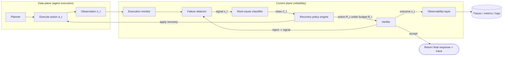
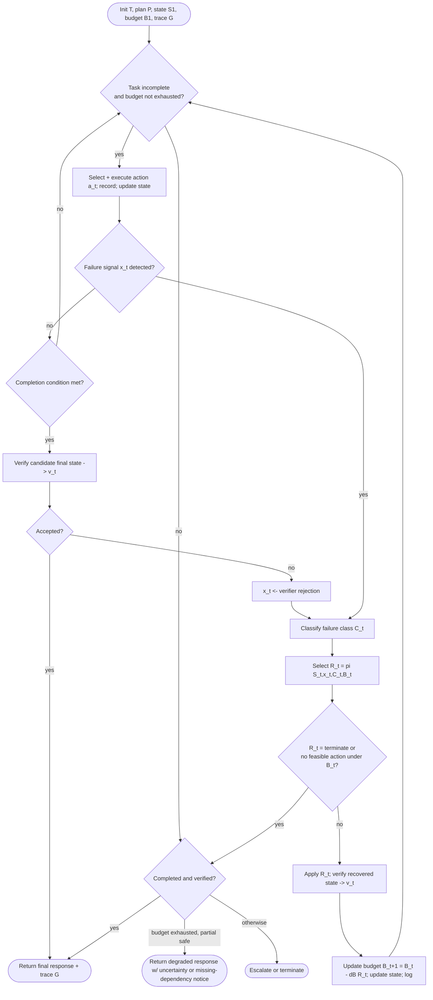

# Self-Healing Agentic Orchestrators for Reliable Tool-Augmented Large Language Model Systems — Summary

> [!NOTE]
> **Source:** [2606.01416-self-healing-agentic-orchestrators.pdf](../../sources/arXiv/2606.01416-self-healing-agentic-orchestrators.pdf) · Rahul Suresh Babu (Independent Researcher) & Adarsh Agrawal (Senior Member, IEEE), 2026 · arXiv:2606.01416v1 [cs.AI], 31 May 2026.
> Study-guide summary of the full document. See the original for exact wording and figures.

## Abstract

This paper reframes reliability in tool-augmented LLM agents as a **bounded runtime control problem** and proposes a **self-healing orchestrator** built around a **monitor → detect → diagnose → recover → verify** loop, layered as a *reliability control plane* over the agent's *execution data plane*. The orchestrator maps observable failure *signals* to inferred failure *classes*, selects a *targeted* recovery action under explicit *budgets*, verifies the recovered trajectory, and records observability *traces*.

**Key points**

- **The control loop is the contribution.** A seven-component control plane (planner, execution monitor, failure detector, root-cause classifier, recovery-policy engine, verifier, observability layer) implements the loop; recovery is *targeted and bounded* rather than a uniform retry or full replan.
- **Failure classes map to specific recovery actions.** Seven failure classes (tool timeout/unavailable, schema/argument, malformed output, incorrect tool selection, stale/insufficient context, contradictory evidence, verification/semantic, control-loop) each get matched actions drawn from `{retry, repair, substitute, replan, refresh, escalate, degrade, terminate}`.
- **Reliability recovered under fault injection:** on a 100-task controlled fault-injection benchmark, self-healing reaches **98.8%** task success vs **94.5%** retry-only, **94.1%** ReAct-style, **93.8%** full replanning, **70.1%** static. Under high-stress faults (λ∈{0.4,0.5}) the gap widens: **97.3%** vs 86.7% / 85.7% / 85.2%.
- **It is not just "trying more":** at a matched single-recovery budget, self-healing hits **94.0%** vs **85.3%** (retry-only) and **88.2%** (full replan); it wins at every budget {1,2,3,5}.
- **Verification kills silent failures:** under a semantic wrong-but-plausible fault model, verifier-guided self-healing cuts silent-failure rate to **0.0%** (100% success) while non-verifying baselines return silent failures **13.2%–17.6%** of the time.
- **Root-cause classification and targeted recovery are load-bearing:** removing either drops success from 99.3% to 95.7%; observability aids diagnosability, not task completion directly.

**Takeaways**

- For a Chapter-4 discipline on loop engineering at the agent-ecosystem level, this is a concrete blueprint: treat reliability as a **control plane** with explicit *detect / diagnose / targeted-recover / bound / verify / trace* responsibilities, separated so detection, diagnosis, and recovery are not conflated.
- The decisive design lesson is **recovery-mismatch avoidance**: the right action depends on the *inferred cause*, not on retrying blindly — retry fixes timeouts, but stale context needs refresh, malformed args need repair, contradictions need cross-checking, and wrong-but-plausible outputs need verification.
- Evidence is **controlled and scoped**: synthetic tasks, deterministic simulated tools, controlled faults, plus a *compact* live-model-in-the-loop bridge (90/60/180 executions). The authors explicitly disclaim production-reliability, real-API, and monetary-cost guarantees; the 100.0% figures hold only within the benchmark's fault templates.

## 1. Introduction

- LLMs increasingly act as **agentic systems** that plan, retrieve, invoke tools, hold intermediate state, and generate responses. Reliability is **not determined only by the base model** — it depends on the **orchestration layer** coordinating tool calls, context, validation, recovery, and termination.
- Failures cluster at the **boundary between model reasoning and execution environment**: tool timeout, schema-violating argument, stale retrieved evidence, contradictory sources, non-progressing retry loop, or an answer unsupported by intermediate evidence.
- **Common recovery is failure-agnostic:** static workflows terminate/branch, retries repeat failed calls, prompt-level self-correction asks the model to revise, full replanning restarts from a broader planning step. None explicitly connect *observable signals → likely causes → targeted actions → budgets → post-recovery verification*.

> [!IMPORTANT]
> The central thesis: treat reliability in tool-augmented LLM systems as an **orchestration-control problem**, solved by a modular self-healing orchestrator implementing a **monitor–detect–diagnose–recover–verify** loop. The key principle is that recovery should be **targeted and bounded** — preserve useful state, pick the action matched to the inferred failure class, and avoid unbounded retry/replan loops.

**Stated contributions:**

- Formulate self-healing orchestration as a system-level reliability problem (execution states, failure signals, failure classes, recovery actions, recovery budgets, reliability objectives).
- A modular orchestrator separating execution monitoring, failure detection, root-cause classification, recovery-policy selection, post-recovery verification, and observability.
- A **targeted, budgeted recovery policy** mapping inferred failure classes to actions (retry, argument repair, tool substitution, retrieval refresh, replanning, graceful degradation, escalation).
- Evaluation on a controlled fault-injection benchmark vs static/retry-only/ReAct/full-replanning baselines, with failure-type analysis and component ablations.
- A matched recovery-budget sensitivity experiment.
- Compact **model-in-the-loop** validation and semantic silent-failure analysis.

## 2. Background and Related Work

### 2.1 Tool-Augmented LLM Agents

Tool-augmented agents extend LLMs with retrieval, external APIs, code execution, memory, and environment interaction — building on retrieval-augmented generation [4], ReAct-style reasoning-and-acting [11], and tool-use methods like Toolformer/ToolLLM [7,6], surveyed in [9]. These expand capability but introduce **new reliability dependencies**: the agent must select tools, construct valid arguments, handle external outputs, maintain context, and judge whether intermediate evidence is reliable. The paper focuses on the **orchestration layer** — the control logic that decides whether an agent can detect, recover from, and explain failures during multi-step execution.

### 2.2 Recovery Patterns in Agentic Systems

Existing mechanisms each address only part of the problem:

- **Static workflows / graph controllers** — deterministic fallback paths, but no explicit failure diagnosis.
- **Retry / fallback / circuit breaker** — good for transient infrastructure faults, but do not distinguish timeouts from stale context, malformed args, wrong tool selection, or semantic inconsistency.
- **ReAct-style loops** — adapt via observation/action.
- **Reflection-based systems (Reflexion [8])** — use feedback to improve future decisions.
- **Planner-executor / full replanning** — recover from some planning errors, but discard useful partial state and add latency/cost when local repair would suffice.

> [!IMPORTANT]
> The **recovery-mismatch problem**: the selected recovery action may not address the underlying cause. Retry helps a transient timeout but does not repair stale context; full replanning can fix an invalid plan but is excessive when a local argument repair, tool substitution, or retrieval refresh would do. A reliability-oriented orchestrator should condition recovery on the **observed signal, inferred class, current execution state, and remaining budget**.

The orchestrator is related to autonomic-computing loops like **MAPE-K** (Monitor–Analyze–Plan–Execute over shared Knowledge) [3,2], but adds **agent-specific** signals and actions (malformed tool arguments, verifier rejection, stale retrieval, contradictory evidence, repeated reasoning/tool loops, unsupported final answers). Self-healing does not replace retry/replan/fallback/circuit-breaking/verification — it treats them as **recovery actions inside a broader control policy**.

**Table 1 — Recovery-mechanism comparison** ("Budget" = explicit bounds on attempts, latency, cost, or recovery depth):

| Approach | Detect | Diagnose | Targeted | Budget | Verify | Trace |
|---|---|---|---|---|---|---|
| Static workflow | – | – | Limited | – | Optional | Limited |
| Retry / fallback / circuit breaker | Yes | – | – | Limited | – | Limited |
| ReAct-style loop | Implicit | – | Implicit | – | – | Partial |
| Full replanning | Yes | – | Coarse | Limited | Optional | Partial |
| MAPE-K-style control | Yes | Yes | Depends | Depends | Depends | Yes |
| **Self-healing orchestration** | **Yes** | **Yes** | **Yes** | **Yes** | **Yes** | **Yes** |

### 2.3 Reliability Evaluation and Fault Injection

Agent evaluation has moved toward interactive, multi-step settings: **AgentBench** [5] highlights long-horizon reasoning/decision/instruction-following failures; tool-augmented failure analyses [10] emphasize errors from tool selection, argument construction, execution, output interpretation, and downstream reasoning; **ReliabilityBench** [1] argues single-run success is insufficient because it misses consistency, robustness, and fault tolerance. This paper uses **controlled fault injection** for *internal validity* (each method sees identical tasks/faults/criteria) plus **compact model-in-the-loop** validation for a bridge to live-model behavior.

## 3. Problem Formulation

> [!NOTE]
> **Self-healing here does not mean unrestricted autonomous repair.** It means recovery within **predefined failure classes, recovery actions, verification checks, and execution budgets**. The formulation does not assume all failures are observable or that inferred classes are always correct.

### 3.1 Execution Model

A user task `T` is executed as a trajectory `τ = {(S₁,a₁,o₁), …, (Sₙ,aₙ,oₙ)}`, where `Sₜ` is orchestrator state, `aₜ` the selected action, `oₜ` the observation. Actions span model reasoning, retrieval, memory access, tool invocation, validation, replanning, recovery, escalation, or final response. State `Sₜ` holds task, plan, action history, observations, tool outputs, retrieved context, verifier feedback, retry/recovery history, budget state, and execution metadata — i.e. the orchestrator is a **runtime control layer**, not merely a prompt template or tool selector.

### 3.2 Failure Signals, Events, and Classes

Three distinct notions:

- **Signal `xₜ`** — an observable indicator (exception, timeout, schema violation, verifier rejection, contradiction, repeated-action pattern).
- **Event `Fₜ`** — occurs when executing `aₜ` violates an expected condition; may be **explicit** (timeouts, exceptions, auth errors, rate limits, invalid schema, malformed output) or **implicit** (contradictory evidence, low verifier confidence, repeated actions, no progress, unsupported conclusions, ungrounded final answer).
- **Class `Cₜ`** — the *inferred* cause (tool-invocation, schema/argument, tool-output, context, planning, verification, or control-loop failure). `Cₜ` is not directly observable; it is inferred from `xₜ` and `Sₜ`.

> [!IMPORTANT]
> **Detected vs silent failure.** A *detected* failure is one the orchestrator observes and acts on. A **silent failure** returns an incorrect/unsupported/stale/inconsistent result *without detection* — it looks externally successful. This distinction drives the evaluation: runtime faults test recovery from explicit errors; the semantic setting tests whether verification catches wrong-but-plausible outputs.

### 3.3 Recovery Policy and Budget

Recovery action set: `R = {retry, repair, substitute, replan, refresh, escalate, degrade, terminate}`, selected by a policy `Rₜ = π(Sₜ, xₜ, Cₜ, Bₜ)`.

The budget is a vector `Bₜ = (bᵣₜ, bˡₜ, bᵏₜ, bᵈₜ)`: remaining **recovery-attempt**, **latency**, **cost**, and **recovery-depth** budgets. Budgets prevent retry storms, excessive replanning, uncontrolled tool use, and recovery whose expected cost exceeds its expected benefit. State update: `Sₜ₊₁ = Φ(Sₜ, aₜ, oₜ, Rₜ, vₜ)`, where `vₜ` is the verification outcome. The same abstraction covers local recovery (repair, retry) and broad recovery (refresh, replan, degrade, escalate).

### 3.4 Reliability Objectives

Three metrics (correctness per task-specific criteria):

| Metric | Definition |
|---|---|
| **Task Success Rate (TSR)** | fraction of `N` tasks completed correctly |
| **Recovery Success Rate (RSR)** | successfully recovered detected failures ÷ detected failures |
| **Silent Failure Rate (SFR)** | incorrect outputs returned without detection ÷ total completed outputs (reported over *completed* outputs since silent failures appear successful) |

Cost model: `K = αM + βU + γV + δR` (M model calls, U tool calls, V verifier calls, R recovery actions; α,β,γ,δ unit-cost weights). Controlled experiments instantiate this as a simple call-count proxy, separating the reliability objective from provider-specific pricing.

## 4. Self-Healing Orchestrator

### 4.1 Architecture Overview

**Figure 1:** a **reliability control plane surrounds the agent execution data plane**. The data plane does ordinary tool-augmented execution (reasoning, retrieval, memory, tool invocation, validation, response generation). The control plane monitors it, detects signals, diagnoses classes, selects budgeted recovery, verifies recovered trajectories, and emits traces. The separation matters because failures occur at the model↔execution boundary: even a capable model fails if a tool is unavailable, an argument malformed, context stale, evidence contradictory, the verifier rejects, or a recovery loop won't terminate. The design is **modular** — planner/detector/classifier/verifier/recovery-policy can be swapped per domain while the control-loop structure stays fixed.

### 4.2 Control-Plane Components (seven logical components)

**Table 2 — component interfaces** (aligned with §3 notation `Sₜ, aₜ, oₜ, xₜ, Cₜ, Rₜ, Bₜ, vₜ`):

| Component | Primary inputs | Primary outputs | Role |
|---|---|---|---|
| **Planner** | Task T, state Sₜ, constraints, verifier feedback | Plan Pₜ, candidate action aₜ, replanning constraints | Proposes executable next steps |
| **Execution monitor** | Action aₜ, observation oₜ, tool metadata, latency, errors | Execution record, updated metadata, candidate signal xₜ | Captures structured execution evidence |
| **Failure detector** | Execution record, validation results, verifier feedback, retry history | Failure signal xₜ or no-failure decision | Detects deviation from expected behavior |
| **Root-cause classifier** | State Sₜ, signal xₜ, execution history, validation results | Inferred failure class Cₜ | Estimates likely cause |
| **Recovery policy engine** | State Sₜ, signal xₜ, class Cₜ, budget Bₜ | Recovery action Rₜ, budget update | Selects a bounded recovery action |
| **Verifier** | Task T, recovered state, tool outputs, retrieved evidence, response candidate | Verification outcome vₜ, accept/reject | Checks validity of recovered execution |
| **Observability layer** | Events, signals, classes, actions, budgets, verifier outcomes | Traces, metrics, logs, final status | Makes recovery diagnosable/evaluable |

Components are separated deliberately so **detection ("did execution deviate?"), diagnosis ("why?"), and recovery ("what to do under budget?") are not conflated** — enabling more precise handling than uniform retry/replan.

### 4.3 Verification and Observability

- **Verification is a first-class control-plane component**, not a final formatting check. The verifier checks schema validity, output completeness, consistency with retrieved evidence, and support for the final response. A **verifier rejection is converted into a recoverable signal** and fed back into the same loop — crucial for semantic silent failures where output is syntactically valid but stale/unsupported/contradictory/incorrect.
- **Observability** records task state, tool calls, evidence, signals, inferred classes, recovery actions, verifier outcomes, budget consumption, and final status. Traces support not just debugging but failure analysis, benchmark construction, regression testing, recovery-policy tuning, and cross-strategy comparison.

The architecture implements the **monitor–detect–diagnose–recover–verify loop** from §3.

## 5. Recovery Policy Design

Instantiates `Rₜ = π(Sₜ, xₜ, Cₜ, Bₜ)`. The policy is **interpretable**: map inferred class → action, apply under budget, verify, log. Objective: choose the **lowest-cost feasible action likely to restore valid execution**, not a uniform strategy.

### 5.1 Failure-to-Recovery Mapping

**Table 3 — the core failure-class → recovery-action mapping** (not exhaustive; deployments may add classes, change thresholds, or restrict actions for safety/authorization/compliance/irreversible-side-effect reasons):

| Failure class | Representative signals | Primary recovery actions | Escalation/termination condition |
|---|---|---|---|
| **Tool timeout / unavailable tool** | Timeout, unavailable endpoint, exception, rate limit | Retry with backoff; substitute equivalent tool; replan around unavailable dependency | Repeated timeout, rate-limit exhaustion, no substitute |
| **Schema / argument failure** | Invalid JSON, missing field, type mismatch, rejected args | Repair arguments; regenerate structured call; schema-constrained prompt | Repeated invalid args or unsupported schema |
| **Malformed / incomplete output** | Empty/partial output, parse failure, missing fields | Validate output; request corrected output; use alternate tool | Output still invalid after repair/alternate |
| **Incorrect tool selection** | Verifier rejects tool choice, irrelevant output, unsupported op | Replan current step; select alternative tool; constrain tool-selection candidates | Repeated tool-selection failure |
| **Stale / insufficient context** | Low evidence score, outdated content, missing context | Refresh retrieval; query alternate source; update memory context | Evidence stays insufficient/outdated |
| **Contradictory evidence** | Conflicting tool outputs or retrieved documents | Cross-check independent source; invoke verifier; request clarification | Conflict unresolvable within budget |
| **Verification / semantic failure** | Verifier rejection, unsupported claim, low evidence, wrong-but-plausible output | Retrieve supporting evidence; regenerate with evidence constraints; add verification step | Verification stays below threshold |
| **Control-loop failure** | Retry storm, repeated actions, no progress, excessive replanning | Terminate loop; replan from stable checkpoint; degrade; escalate | Max recovery budget reached |

The point: retry/repair/substitute/refresh/replan/verify/degrade/escalate are **recovery actions inside one policy**, chosen by signal + class + state + budget — the central difference from mechanisms that apply the same action to every failure.

### 5.2 Recovery Budget

Implemented budget: `Bₜ = (bʳₜ, bᵖₜ, bˢₜ, bᵐₜ, bᴸₜ, bᴷₜ)` = remaining **retry**, **replanning**, **tool-substitution**, **model-escalation**, **latency**, and **cost** budgets. The budget (i) prevents unbounded retry/replan loops, (ii) makes reliability–cost trade-offs explicit, (iii) defines when to degrade/escalate/terminate. Update: `Bₜ₊₁ = Bₜ − ΔB(Rₜ)`. **Failed recovery attempts still consume budget** because their latency/cost was already incurred.

### 5.3 Policy Algorithm (Algorithm 1)

The algorithm separates ordinary execution from recovery: normal actions update state directly; detected failures or verifier rejections route through classification → budgeted recovery → verification → trace logging. The implementation uses **fixed recovery mappings and deterministic budget updates** so method differences are attributable to orchestration behavior, not policy noise (the same structure could host learned/model-assisted policies).

### 5.4 Escalation and Policy Scope

**Priority ordering: local, low-cost repairs before global recovery.** Argument repair, retry, retrieval refresh, and tool substitution are preferred when the failure is narrow and remaining state is trustworthy. Replanning, graceful degradation, model/human escalation, and termination are reserved for failures that can't be repaired locally or whose budget is exhausted. This avoids both extremes — blind cheap retries and premature expensive replanning.

## 6. Experimental Setup

Two tracks: (1) a **controlled fault-injection benchmark** (deterministic tools, fixed tasks, matched fault schedules, paired seeds → internal validity); (2) a **compact model-in-the-loop validation** where a live tool-calling model does tool selection, argument generation, and answer synthesis over local deterministic fault-injected tools (not a production-API evaluation).

### 6.1 Research Questions

- **RQ1:** Does self-healing improve task success under controlled runtime/tool-output faults?
- **RQ2:** Which injected failure classes benefit most from targeted recovery?
- **RQ3:** Which self-healing components contribute most to reliability?
- **RQ4:** Does targeted recovery beat retry-only and full replanning under **matched** budgets?
- **RQ5:** Does verifier-guided recovery reduce semantic silent failures?
- **RQ6:** Does the same mechanism operate with a live tool-calling model?

### 6.2 Controlled Benchmark

**100 synthetic tasks**, evenly split across five categories: retrieval/evidence synthesis, multi-step API workflows, calculation/verification, planning/tool selection, contradiction resolution. Each task record holds id, category, request, required tools, expected answer, success criteria, eligible faults, and execution plan. All tasks validated in the no-fault setting first. Deterministic tool set with known ground truth: document search, policy lookup, customer lookup, order lookup, inventory lookup, calculator, shipping estimator, evidence checker, tool-registry functions. Simulated tools make fault timing, recovery opportunities, and success criteria reproducible.

### 6.3 Fault Injection

Seven detectable fault classes: **timeout, unavailable tool, malformed output, schema drift, partial response, stale context, contradictory evidence**. Intensity `λ ∈ {0.0, 0.1, 0.2, 0.3, 0.4, 0.5}`, applied **per eligible tool step** (so multi-step tasks are likelier to hit a fault). Primary regime `λ∈{0.0–0.3}`; high-stress regime `λ∈{0.4,0.5}`. Fault schedules are **deterministic and task-aware** — the seed depends on task id, method, trial seed, recovery attempt, step index, and intensity; the **same seed set is shared across methods** for paired comparison. Semantic faults are separate: a correct tool output is replaced by a **wrong-but-plausible** but syntactically valid output that violates the success criterion.

### 6.4 Compared Methods

- **Static workflow** — fixed tool sequence, no adaptive recovery.
- **Retry-only** — retries failed calls up to a fixed limit, no classification/targeted recovery.
- **ReAct-style** — repeated reason-and-act (per [11]), but no explicit budgets, class diagnosis, or verifier-guided recovery.
- **Full replanning** — discards the failed attempt and replans before re-execution.
- **Self-healing** — detect → classify → targeted budgeted recovery → verify → trace.

All share tasks/tools/fault protocol/success criteria/timeouts/execution limits; only orchestration behavior differs. Model-in-the-loop uses the recovery-enabled subset: retry-only, full replanning, self-healing.

### 6.5 Model-in-the-Loop Validation

Live tool-calling model does tool selection, structured argument generation, and answer synthesis; tools stay local, deterministic, fault-injected. Three parts: **main validation** (retry-only/full-replan/self-healing, 90 executions), **verifier ablation** (verifier-on vs -off, 60), **budget-sensitivity sweep** (180). Purpose is an *external-validity bridge*, not a replacement for the controlled study.

### 6.6 Evaluation Metrics

TSR, RSR, SFR (per §3.4), plus average recovery steps, tool/model/verifier calls, simulated latency, escalation rate, trace completeness. Controlled **cost proxy = N_tool + N_model + N_verify** (relative overhead, not dollars).

### 6.7 Experiment Suite

**Table 4 — experiment design:**

| Experiment | Design | Executions | Primary metrics |
|---|---|---|---|
| Controlled main reliability | 100 tasks × 5 methods × 6 fault intensities × 3 seeds | 9000 | Success, recovery, cost, latency |
| Failure-class analysis | Faulted subset of main, grouped by fault class & method | Subset | Success & recovery by fault class |
| Controlled ablation | 100 tasks × 6 self-healing variants × 5 nonzero intensities × 3 seeds | 9000 | Success, recovery, cost, traces |
| Controlled budget sensitivity | 100 tasks × 3 methods × 4 budgets × 2 intensities × 3 seeds | 7200 | Success vs budget & cost |
| Semantic silent-failure | 100 tasks × 6 semantic variants × 4 semantic intensities × 3 seeds | 7200 | Silent failure, success, verifier calls |
| Trace diagnosability | Representative recovered executions | 3 traces | Signal, class, action, verifier outcome |
| Model-in-loop main | 15 tasks × 3 methods × 2 seeds | 90 | Success, detection, recovery, traces |
| Model-in-loop verifier ablation | 15 tasks × 2 verifier variants × 2 seeds | 60 | Success, detection, recovery |
| Model-in-loop budget sensitivity | 10 tasks × 3 methods × 3 budgets × 2 seeds | 180 | Success & recovery by budget |

### 6.8–6.9 Controlled Experiments & Execution Protocol

Ablation variants: full self-healing vs **without verifier, without root-cause classifier, relaxed recovery budget, without targeted recovery, without observability traces**. Budget sweep matches budgets `{1,2,3,5}` at `λ∈{0.2,0.4}`. Semantic sweep `λs∈{0.0,0.1,0.2,0.3}`. Trace analysis extracts three representative self-healing traces (runtime/tool, context/evidence, semantic silent). All methods run under matched task/tool/fault/seed schedules. The controlled benchmark is the **primary mechanism-isolation study**; model-in-the-loop is a compact bridge. Neither claims to measure production incident rates, external-API reliability, or deployment-specific monetary cost.

## 7. Results

### 7.1 Controlled Reliability

**Table 5 — overall (100 tasks, 6 intensities, 3 seeds):**

| Method | Success (%) | Recovery (%) | Silent Failure (%) | Tool Calls | Verifier Calls | Cost Proxy |
|---|---|---|---|---|---|---|
| Static workflow | 70.1 | 0.0 | 0.0 | 1.61 | 0.00 | 1.61 |
| Retry-only | 94.5 | 24.0 | 0.0 | 2.24 | 0.00 | 2.24 |
| ReAct-style | 94.1 | 22.6 | 0.0 | 2.23 | 0.00 | 3.63 |
| Full replanning | 93.8 | 21.0 | 0.0 | 2.23 | 0.00 | 3.63 |
| **Self-healing** | **98.8** | **27.6** | 0.0 | 2.25 | 1.00 | 3.25 |

- Self-healing is **+4.3 pts** over retry-only (strongest non-self-healing baseline) and **+5.0 pts** over full replanning.
- Self-healing reaches higher reliability at **lower cost proxy (3.25) than ReAct-style/full-replanning (3.63)**.
- The 0.0% silent-failure here applies **only to the detectable runtime-fault setting**; semantic silent failures are §7.5.

**Table 6 — primary vs high-stress regime** (**Figure 2**: static workflow degrades sharply as λ rises; recovery-enabled methods degrade gradually; self-healing highest across both regimes):

| Method | Primary Success (%) | Primary Cost | Stress Success (%) | Stress Cost |
|---|---|---|---|---|
| Static workflow | 80.4 | 1.65 | 49.3 | 1.52 |
| Retry-only | 98.4 | 2.04 | 86.7 | 2.65 |
| ReAct-style | 98.3 | 3.26 | 85.7 | 4.38 |
| Full replanning | 98.2 | 3.28 | 85.2 | 4.32 |
| **Self-healing** | **99.6** | 3.03 | **97.3** | 3.68 |

Targeted recovery becomes **more valuable as tool instability increases**. **Figure 3** (cost–reliability): self-healing improves reliability over full replanning while cutting the cost proxy from 3.63 → 3.25.

### 7.2 Failure-Type Analysis

**Table 7 — success by injected fault type**, over executions with ≥1 injected fault (static = 0.0% everywhere, no recovery once interrupted):

| Failure type | Static | Retry-only | ReAct | Full replan | Self-healing |
|---|---|---|---|---|---|
| Contradictory evidence | 0.0 | 85.7 | 79.5 | 68.6 | **100.0** |
| Malformed output | 0.0 | 68.8 | 81.1 | 71.1 | **98.2** |
| Partial response | 0.0 | 59.0 | 61.1 | 61.1 | **89.7** |
| Schema drift | 0.0 | 62.7 | 49.6 | 62.8 | **89.6** |
| Stale context | 0.0 | 73.1 | 79.4 | 64.6 | **100.0** |
| Timeout | 0.0 | 62.9 | 55.3 | 52.9 | **79.3** |
| Unavailable tool | 0.0 | 64.4 | 50.9 | 44.0 | **75.3** |

Self-healing is **strongest for every evaluated fault class** (Figure 4). **Largest gains: stale context and contradictory evidence → 100.0%** within the controlled templates (targeted retrieval refresh, evidence cross-checking, and verification beat uniform retry/replan). Weakest absolute classes are timeout (79.3%) and unavailable tool (75.3%). The authors caution the 100.0% figures are **not universal guarantees**.

### 7.3 Ablation Study

**Table 8 — ablation (nonzero runtime fault intensities):**

| Variant | Success (%) | Recovery (%) | Recovery Steps | Cost Proxy | Trace Events |
|---|---|---|---|---|---|
| Full self-healing | 99.3 | 32.3 | 0.43 | 3.30 | 2.18 |
| No verifier | 99.3 | 32.3 | 0.43 | 2.30 | 2.18 |
| No classifier | 95.7 | 28.7 | 0.56 | 3.45 | 2.45 |
| Relaxed recovery budget | 100.0 | 33.0 | 0.44 | 3.31 | 2.21 |
| No targeted recovery | 95.7 | 28.7 | 0.56 | 3.45 | 2.45 |
| No observability traces | 99.3 | 32.3 | 0.43 | 3.30 | 0.00 |

- **Removing the classifier OR targeted recovery both drop success 99.3% → 95.7%** — the *mapping from class to action* matters, not merely repeated attempts.
- **No-verifier matches full self-healing here (and is cheaper)** because runtime faults expose explicit signals; verification's payoff is in the semantic setting (§7.5).
- **Relaxed budget → 100.0%** (more attempts help completion), which motivates the matched-budget test in §7.4.
- **No observability keeps 99.3% success but zeroes trace events** — observability serves diagnosability, not direct task completion.

### 7.4 Recovery-Budget Sensitivity

**Table 9 — task success (%) under matched budgets** (retry-only / full-replan / self-healing):

| Recovery budget | Retry-only | Full replanning | Self-healing |
|---|---|---|---|
| 1 | 85.3 | 88.2 | **94.0** |
| 2 | 93.8 | 94.3 | **97.8** |
| 3 | 96.7 | 97.8 | **99.2** |
| 5 | 99.2 | 99.3 | **100.0** |

- **Self-healing wins at every budget; largest gap at budget 1** (94.0 vs 85.3 vs 88.2). Effect strongest under higher fault intensity: at `λ=0.4`, budget 1, self-healing reaches **90.3%** vs **79.0%** (retry-only) and **81.7%** (full replan).
- Directly rebuts the "just try more" alternative: targeted recovery uses limited opportunities more effectively.
- Cost at budget 1: self-healing **3.13** vs retry-only **2.15** vs full-replan **3.45** — more expensive than retry-only (verification + targeted logic) but **cheaper than full replanning while more reliable**.

### 7.5 Semantic Silent-Failure Results

**Table 10 — controlled semantic (wrong-but-plausible) fault model:**

| Method | Success (%) | Silent Failure (%) | Recovery (%) | Verifier Calls | Cost Proxy |
|---|---|---|---|---|---|
| Static workflow | 84.8 | 15.2 | 0.0 | 0.00 | 1.74 |
| Retry-only | 85.4 | 14.6 | 0.0 | 0.00 | 1.74 |
| ReAct-style | 86.8 | 13.2 | 0.0 | 0.00 | 2.74 |
| Full replanning | 84.5 | 15.5 | 0.0 | 0.00 | 2.74 |
| Self-healing **without** verifier | 82.4 | 17.6 | 0.0 | 0.00 | 1.74 |
| **Self-healing with verifier** | **100.0** | **0.0** | 13.9 | 1.14 | 3.12 |

> [!IMPORTANT]
> **Runtime failure detection alone is insufficient for wrong-but-plausible outputs.** Non-verifying methods return silent failures **13.2%–17.6%** of the time; verifier-guided self-healing drives silent failure to **0.0%** (100.0% success) under the controlled templates (**Figure 7**). Semantic validation must be *part of the recovery loop*. (Scoped to the templates — not a universal guarantee.)

### 7.6 Model-in-the-Loop Validation

**Table 11 — main validation (90 executions):** all three methods reach **100.0% success** on the compact task set (success saturates, so this is not the differentiating result — its value is showing the machinery *runs* with a live model).

| Method | Executions | Success (%) | Detection (%) | Recovery Success (%) |
|---|---|---|---|---|
| Retry-only | 30 | 100.0 | 46.7 | 20.0 |
| Full replanning | 30 | 100.0 | 46.7 | 46.7 |
| Self-healing | 30 | 100.0 | 46.7 | 46.7 |

**Table 12 — verifier ablation (60 executions)** — the more informative live-model result:

| Variant | Executions | Success (%) | Detection (%) | Recovery Success (%) |
|---|---|---|---|---|
| Verifier off | 30 | 96.7 | 20.0 | 16.7 |
| Verifier on | 30 | **100.0** | **46.7** | **46.7** |

Enabling verification improves success **96.7 → 100.0%**, detection **20.0 → 46.7%**, recovery **16.7 → 46.7%**. The supplemental budget sweep (180 executions) hits 100.0% success for all three methods at all budgets, but recovery success differs: retry-only stays 25.0% while full-replan and self-healing reach 55.0%. Because success saturates, the **controlled §7.4 sweep remains the primary evidence** for budget efficiency. The model-in-the-loop results address an external-validity limitation but are **not production validation** (tools local/deterministic, faults controlled).

### 7.7 Trace-Based Diagnosability

**Table 13 — three representative self-healing traces** (each records task id, tool calls, injected fault, detected signal, inferred class, recovery action, verifier outcome, budget, final status):

| Case | Task / category | Fault | Recovery outcome |
|---|---|---|---|
| Runtime/tool failure | workflow 001; multi-step API | Timeout | Retry with backoff; 1 verifier call; recovered: True |
| Context/evidence failure | retrieval 001; retrieval evidence | Stale context | Refresh retrieval; 1 verifier call; recovered: True |
| Semantic silent failure | retrieval 002; retrieval evidence | Semantic wrong output | Verification-guided recovery; 2 verifier calls; recovered: True |

Traces record not just final status but **why** recovery triggered and **how** the decision was made — making recovery inspectable for diagnosis, regression testing, and policy tuning.

### 7.8 Summary of Findings (seven)

1. Self-healing improves controlled runtime reliability (**98.8%** vs 94.5% retry-only, 93.8% full replan).
2. Advantage grows under stress (**97.3%** vs 86.7% / 85.2%).
3. Targeted recovery is strongest across **all seven** evaluated fault classes.
4. Ablations: **root-cause classification and targeted recovery** are important contributors.
5. Matched-budget sweep: self-healing is **not merely "trying more"** — it wins at every budget.
6. Verifier-guided recovery **reduces silent failures** under the controlled semantic model.
7. The same mechanism **operates with a live tool-calling model** (production-API validation remains future work).

## 8. Discussion

Central thesis reaffirmed: reliability in tool-augmented LLM systems is **partly an orchestration problem** — task completion depends on how the system handles tool failures, stale/contradictory context, invalid states, verifier rejections, and recovery termination, treated as **control-plane signals** rather than undifferentiated failures.

### 8.1 Targeted Recovery Under Bounded Budgets

Different failure classes need different actions: retry suits transient faults but is poorly matched to stale context, schema drift, contradictions, or wrong-but-plausible outputs; full replanning is general but discards useful partial state and adds overhead when local repair/refresh/substitution/verification would suffice. The **matched-budget sweep is the decisive evidence**: self-healing wins at every budget, largest gap at budget 1 (94.0% vs 85.3% / 88.2%). **Retry-only remains a useful baseline** for simple transient faults/low-risk tasks — the implication is not to remove retry but to make it *one action within a broader policy* that decides when retry, local repair, replanning, degradation, or escalation is appropriate.

### 8.2 Verification, Silent Failures, and Observability

Runtime monitoring alone misses semantic failures (syntactically valid but unsupported/stale/contradictory/incorrect). Non-verifying methods silently fail 13.2%–17.6% of the time; verifier-guided self-healing → 0.0% under the templates. **Verification belongs in the control loop**: a rejection becomes a recoverable signal (refresh evidence, regenerate under evidence constraints, or escalate). Caveat: verifier quality depends on task definition, evidence availability, domain complexity, model behavior, and verifier design; deployment must tune for false-acceptance/false-rejection costs. **Observability is complementary** — it preserves task success unchanged but enables debugging, regression testing, incident review, policy tuning, and converting observed failures into future benchmark cases.

### 8.3 Controlled Evaluation and Model-in-the-Loop Scope

Controlled benchmark = **internal validity** (attributes differences to orchestration behavior) but doesn't capture all real model/API variability. Model-in-the-loop partially closes the gap: the main experiment **saturates on success** (weak differentiator), but the **verifier ablation is informative** (verification improves success/detection/recovery). Live-model validation is **no longer purely future work**, but remains compact — it does not measure production API reliability, naturally occurring incidents, real user traffic, large-scale retrieval, or provider-specific cost.

### 8.4 Deployment Implications

- Tune recovery policies to **application risk, latency, tool cost, safety**. The cost proxy shows relative overhead, not real money; verifier calls can dominate cost if they use a stronger model, long context, or multiple cross-checks — control verifier frequency, recovery depth, model escalation, human-escalation thresholds.
- **Tool semantics matter.** Read-only tools tolerate retry/refresh/substitution; tools with **irreversible side effects** (purchases, account changes, notifications, writes) need conservative recovery, stronger verification, idempotency checks, and possibly human confirmation. Auth/authorization/privacy/audit constraints may restrict allowed actions.
- Broader implication: reliable agents combine **failure-aware recovery + explicit budgets + verification + traceability** — recover when there's enough evidence to proceed safely; degrade/clarify/escalate when there isn't.

## 9. Limitations and Threats to Validity

Results support claims about failure-aware orchestration **under the evaluated conditions**, not production reliability for arbitrary agents/APIs/users/environments.

- **Construct validity:** synthetic success criteria are simpler than real user goals; recovery success is measured against injected faults/expected outputs, not business correctness. Cost/latency are relative call-count proxies (no provider pricing, tokens, model tiers, network, storage, human-review cost). Silent failure uses controlled wrong-but-plausible faults — 100.0% within templates is *not* a universal guarantee.
- **Internal validity:** paired design (same tasks/tools/faults/seeds/limits/criteria) mitigates confounds. Two residual threats: **author-constructed tasks/templates** may align with the proposed policy (mitigated by multiple categories, fault classes, semantic faults, stress settings, ablations, matched budgets); **baselines are representative controlled implementations**, not exhaustive optimized frameworks.
- **External validity:** synthetic tasks, simulated deterministic tools, controlled faults; model-in-the-loop is compact with local deterministic tools. Recovery effectiveness varies by domain (timeout may be safe to retry; an auth error needs re-authorization; substitution needs compatible semantics/authorization/side effects). High-risk domains (finance, healthcare, legal, operational automation) may need stricter verification, conservative degradation, human escalation, or explicit user confirmation.
- **Conclusion validity & reproducibility:** execution counts — controlled main **9000**, ablation **9000**, budget-sensitivity **7200**, semantic **7200**; model-in-the-loop **90 / 60 / 180**. These support stable within-benchmark comparison but are not statistical estimates over real workloads. The **primary conclusion is comparative and scoped**. Artifact package includes controlled + model-in-the-loop notebooks, structured task definitions, result CSVs, generated figures, LaTeX tables, health checks, and JSON recovery traces.

**Table 14 — validity threats and mitigations** (condensed):

| Threat | Limitation | Mitigation |
|---|---|---|
| Benchmark scope | 100 synthetic tasks | Span five categories; released as structured artifacts |
| Task-generation bias | Author-constructed tasks may align with the policy | Multiple fault classes, baselines, ablations, semantic faults, stress, matched budgets |
| Simulated tools | Miss real API behavior/latency/auth/side effects | Enable reproducible fault injection + paired comparison |
| Model-in-loop scale | Compact, local deterministic tools | Bridge to live model while preserving controlled faults |
| Fault-model completeness | Evaluated faults ≠ all production failures | Include runtime, output, context, control-loop, semantic classes |
| Cost/latency | Relative proxies, not dollars/wall-clock | Consistent accounting across methods; production cost = future work |
| Verifier scope | Verifier uses controlled success criteria | Framed as controlled silent-failure evidence, not a guarantee |
| Baseline implementation | Representative, not all optimized agents | Shared tasks/tools/seeds/faults/criteria for paired comparison |
| External generalization | May not transfer to production/high-risk domains | Needs real tools, production traces, larger sets, domain policies |

## 10. Future Work

1. **Scale live-model validation** to real external APIs, production retrieval, realistic latency distributions, and naturally occurring failure traces; test whether gains persist under changing model versions, stochastic tool-call generation, auth failures, API schema drift, data-freshness issues, and long-running workflows.
2. **Recovery-policy learning + stronger verification:** hybrid policies that keep rule-based safety constraints while *learning* when to retry/repair/refresh/substitute/replan/escalate/terminate from historical traces — evaluated for latency, tokens, monetary cost, verifier overhead, escalation burden; plus verifier calibration, evidence grounding, false-accept/reject analysis, cross-source consistency, human review.
3. **Safe side-effecting/high-risk tool use:** idempotency checks, authorization boundaries, privacy constraints, safety budgets, explicit user confirmation, human escalation when confidence is insufficient; and **standardized observability schemas** for agentic traces to compare orchestrators, reproduce failures, and build shared agent-failure datasets.

## 11. Conclusion

Self-healing orchestration frames reliability as a **runtime orchestration-control problem**, mapping execution state, failure signals, inferred classes, recovery budgets, verification outcomes, and observability traces into a structured **bounded-recovery** control loop. On the controlled benchmark it achieved the highest reliability (**98.8%** vs 94.5% retry-only, 93.8% full replan), with a larger high-stress advantage (**97.3%** vs 86.7% / 85.2%). Ablations and failure-type analysis show root-cause classification and targeted recovery are important; the matched-budget sweep shows the gain is **not** from more attempts (94.0% vs 85.3% / 88.2% at budget 1). Verifier-guided recovery reduced semantic silent failures to **0.0%** under the controlled model. Compact model-in-the-loop validation shows the mechanism operates with a live tool-calling model. Evidence is strongest within the controlled + compact settings; **larger live-model studies with real APIs, production traces, natural failures, and measured costs remain future work.**

## References (selected)

- [1] A. Gupta. *ReliabilityBench: Evaluating LLM agent reliability under production-like stress conditions.* arXiv:2601.06112, 2026.
- [2] IBM Corporation. *An architectural blueprint for autonomic computing.* White paper, 2006.
- [3] J. O. Kephart & D. M. Chess. *The vision of autonomic computing.* Computer, 36(1):41–50, 2003.
- [4] P. Lewis et al. *Retrieval-augmented generation for knowledge-intensive NLP tasks.* NeurIPS 33, 2020.
- [5] X. Liu et al. *AgentBench: Evaluating LLMs as agents.* ICLR 2024.
- [6] Y. Qin et al. *ToolLLM: Facilitating LLMs to master 16000+ real-world APIs.* ICLR 2024.
- [7] T. Schick et al. *Toolformer: Language models can teach themselves to use tools.* NeurIPS 36, 2023.
- [8] N. Shinn et al. *Reflexion: Language agents with verbal reinforcement learning.* NeurIPS 36, 2023.
- [9] L. Wang et al. *A survey on large language model based autonomous agents.* Front. Comput. Sci., 18(6):186345, 2024.
- [10] C. Winston & R. Just. *A taxonomy of failures in tool-augmented LLMs.* IEEE/ACM AST 2025, 125–135.
- [11] S. Yao et al. *ReAct: Synergizing reasoning and acting in language models.* ICLR 2023.
