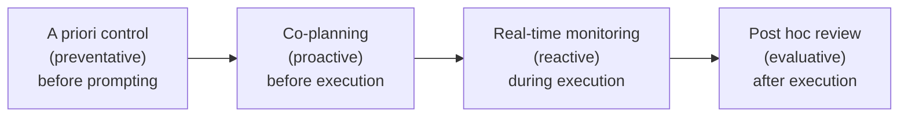

# Human Oversight of Agentic Systems in Practice: Examining the Oversight Work, Challenges, and Heuristics of Developers Using Software Agents — Summary

> [!NOTE]
> **Source:** [2606.05391-human-oversight-agentic-practice.pdf](../../sources/arXiv/2606.05391-human-oversight-agentic-practice.pdf) · Shipi Dhanorkar, Samir Passi & Mihaela Vorvoreanu (Microsoft, USA), 2026 · arXiv:2606.05391 [cs.SE], 3 Jun 2026 · https://arxiv.org/abs/2606.05391 (positioned as a contribution to FAccT scholarship; no conference venue is printed on the preprint).
> Study-guide summary of the full document. See the original for exact wording and figures. Dhanorkar and Passi contributed equally.

## Abstract

An exploratory qualitative interview study of how experienced software developers actually oversee coding agents (Claude Code, Cursor, Cline, GitHub Copilot agent mode, Codex, etc.) in professional practice — the paper's aim is to supply "early empirical anchors" for a human-oversight literature that has so far been mostly conceptual and normative.

**Key points**

- **Design:** semi-structured 1:1 interviews (July–August 2025, ~60 min each) with **17 experienced developers**, criterion-sampled for regular professional agent use — 16 of 17 used agents several times a week (12 daily); 13 had 7+ years of programming experience; 12 of 17 worked at the authors' own large tech company. Three-round inductive coding (in-vivo open codes → 13 axial codes → 2 conceptual categories).
- **Four forms of emergent oversight work:** **a priori control** (preventative — configuring settings, deny lists, custom instructions before delegating), **co-planning** (proactive — drafting plans, iterative prompting, seeding partial solutions, task decomposition), **real-time monitoring** (reactive — watching logs/traces, pausing mid-run), and **post hoc review** (evaluative — verifying and correcting outputs after execution). Oversight is thus not only reactive and evaluative, as prior research portrays, but also preventative and proactive — it begins before the first prompt.
- **Real-time monitoring was rare and perfunctory.** Participants almost never watched reasoning traces vigilantly; they relied on indirect cues (abnormally long run time, ballooning context) and found mid-run redirection unreliable — often easier to stop and restart. The authors hypothesise small task decomposition made monitoring optional.
- **Four heuristics for post hoc review**, adopted because exhaustive review is unscalable: (1) *the plan is a faithful proxy for the agent's actual working*; (2) *passing tests guarantee code correctness*; (3) *eyeballing agent-related information reliably signals issues*; (4) *it is reasonable to trust agents in unfamiliar domains* (epistemic deference, with a "social proof" variant — two agents agreeing raises confidence).
- **Central takeaway:** oversight functions "not through exhaustive awareness, but through practical heuristics" — good-enough supervision driven by **bounded rationality** (Simon). Developers **satisfice rather than optimise** oversight; the heuristics are "not lazy shortcuts but necessary adaptations", surfacing a disconnect between research aspirations of continuous "meaningful human control" and practice.

**Takeaways**

- Governance frameworks (e.g. EU AI Act Article 14) mandate human oversight but assume it is feasible without specifying what it looks like; this study shows what it actually looks like: configuration, co-planning, spot checks, and test-mediated trust, under time pressure.
- Designing *overseeable* agents means supporting the heuristics developers already use: configuration guides and visible custom-instruction affordances (a priori control), prompting help and sub-task suggestions with cost/preview (co-planning), reasoning panels and contextual signals like memory/time visualisation (monitoring), and intent-annotated diffs plus rationale interleaving to shrink the developer–code cognitive distance (review).
- The developer role is shifting from 'craftsman' to **'developer-manager'**: core competency moves from syntax mastery to architectural design, critique and review — with open questions for skills, professional identity, and organisational compliance when legally mandated oversight collides with efficiency-driven heuristics.

## 1 Introduction

Agentic systems — which autonomously plan, use tools, and act — have entered developer workflows via tools such as Cursor, Claude Code, Cline, ChatGPT Codex and GitHub Copilot. But agents misinterpret requests, err in tool interactions, fail to spot their own mistakes, and lose context; errors range from localized file deletions to the Replit agent's database erasures, and agents pose cybersecurity risk both as victims (prompt injection, e.g. Gemini CLI) and enablers (the Claude Code-orchestrated espionage incident). Automated safety methods (red teaming, agents-as-judge) are limited by the scenarios they encode, making **human oversight** central — and increasingly legally mandated (EU AI Act requires meaningful human control over high-risk AI). Yet such frameworks *assume* oversight is feasible without examining what it looks like in practice, and users struggle to spot mistakes even in conventional AI outputs while agents add new failure modes and require assessing actions, not just outputs.

Two research questions: **(RQ1)** How do developers oversee software agents in practice? **(RQ2)** What oversight challenges do they face and how do they address them? The authors deliberately study *power users* — early adopters and heavy users in well-resourced organisations — because they signal emergent practices, and challenges they face will be worse for other groups. Three contributions: (1) one of the first empirical accounts of the lived reality of agent oversight; (2) an exploratory analysis of four forms of oversight work plus challenges and heuristics, showing developers opt for *efficient, not perfect,* oversight; (3) research directions and design/practice implications.

## 2 Literature Review

### 2.1 Human oversight of AI

Two framing insights from research on oversight of conventional AI: (a) reviewing AI outputs — spotting and correcting mistakes — is considered the crux of oversight; (b) the field has significant empirical gaps: most work is either narrowly controlled studies of artificial verification tasks with proxy measures, or conceptual frameworks and theories. Result: a research–practice disconnect that leaves oversight efforts "largely aspirational".

### 2.2 Agents in software development

Since the 2021 Codex breakthrough, coding agents handle debugging/patching, translation, refactoring, and test generation; productivity evidence includes Sarkar's natural experiment finding organisations using Cursor's agent achieved **26% more repository merges**. But agents show hallucinations, security vulnerabilities, reasoning–action misalignment, MCP-borne attacks, memory pitfalls, test-passing-but-broken patches, and instruction-following failures — and controlled benchmarks (SWE-bench, RedCode, BigCodeBench, CodeLMSec) do not reflect real software lifecycles. Adjacent human-centred work hints at oversight's importance: as agents take over execution, humans concentrate on monitoring and debugging (Chen et al.); experienced developers "rarely vibe code", iteratively steering instead (Huang et al.); novices struggle with agent usability (Shome et al.).

### 2.3 Human oversight in FAccT scholarship

FAccT links oversight to accountability, auditing, fairness, harm and responsibility, with **transparency** as the common thread — users need "epistemic access" (Sterz et al.). But explanations can mislead, exacerbating automation bias and overreliance. Agents raise the stakes: reward hacking produces right outputs for wrong reasons, so users must review both outputs *and* workings; Chan et al. call for new forms of "visibility" into agents, balanced against workload and cognition trade-offs. The field lacks empirical, human-centred accounts of how users navigate these trade-offs in practice — the gap this paper addresses.

## 3 Research Methodology

### 3.1 Participants

- **Criterion sampling** on experienced professional agent use (definition: an agent autonomously plans and acts using tools and environment interaction; autocomplete does not count), plus snowball recruitment and a screener; one participant was excluded via secondary screening in the interview's opening questions.
- **17 participants**: 16/17 used agents several times a week for professional work (**12 daily**); self-reported agent experience: 9 'experienced', 4 'somewhat experienced', 4 'very experienced'. **13 had 7+ years programming experience**, two over 4 years, two more than a year; domains spanned ad experimentation, fintech, research, and storage systems.
- Also an **intensity sample** of power users in well-resourced organisations. **12 of 17 worked at the same large tech organisation as the authors** (recruitment was hampered by NDAs and the competitive agent landscape); those 12 were on distinct, non-overlapping teams, and the 5 external participants reported similar experiences.
- Appendix A details demographics: 15 M / 2 F; mostly US-based (plus India and Brazil); roles mostly software engineer/developer plus two engineering managers, a TPM, and a data science/ML engineer; agents used include GitHub Copilot (most common), Cursor, Claude Code, Cline, Codex/Codex CLI, Gemini, Amazon CodeWhisperer, Amazon Kiro, and Aider.

### 3.2 Data collection and analysis

Semi-structured 1:1 video interviews by the first author, ~60 minutes, July–August 2025, transcribed with Marvin, US $40 gift card, IRB-approved. Rather than impose a definition of oversight, participants explained what oversight meant to them; questions used **temporal anchoring** (before / during / after execution), so the four-form structure is "a useful organizing device and not an exact representation" — though participants organised responses temporally even unprompted. Analysis: three-round qualitative inductive coding — (1) open in-vivo coding (e.g. "set deny lists", "co-plan with agents"); (2) **13 axial codes** (e.g. co-planning, review strategies); (3) selective coding into the two conceptual categories that structure the findings. Authors resolved ambiguities jointly — e.g. keeping a priori control vs. co-planning distinct (configuring pre-established controls vs. actively steering), and settling whether heuristics were risky shortcuts or coping mechanisms by revisiting participants' motivations (verdict: "imperfect-yet-necessary shortcuts to do good enough post hoc review").

## 4 Findings

### 4.1 Four forms of human oversight work

Table 2 (Appendix D) of the paper defines the four forms; reproduced in essence:

| Oversight work | Character | What it is | Example practices |
|---|---|---|---|
| **A priori control** | Preventative | Instructing agents to direct and limit their workings before delegating tasks | Configuring agent settings/autonomy, deny lists, constraining boundaries, supplying global context (e.g. repo instruction files) |
| **Co-planning** | Proactive | Pre-execution goal-setting done jointly by developer and agent to establish common ground | Drafting plans with agents, iterative prompting, seeding partial solutions, task decomposition |
| **Real-time monitoring** | Reactive | Observing agents as they perform tasks and intervening when needed | Watching action logs and reasoning traces, pausing/stopping agents mid-execution |
| **Post hoc review** | Evaluative | Reviewing and correcting agent outputs after execution | Verifying outputs via diff tools, LLM-as-judge, layered testing, re-prompting to fix issues |

#### 4.1.1 A priori control

Goal: define clear boundaries and set agents up to minimise failure. P15: the repo instruction file is "the most important asset [...] that you're constantly maintaining, improving, and iterating." Motivated by agents' unpredictability ("sometimes it follows your instructions, sometimes it [...] goes on a tangent" — P11); specifics depend on failures the developer imagines or has already hit (e.g. P03's deny list against deletions). Effort varied widely — some invested heavily in configuration and dependency contracts, others just used the defaults ("I have not messed around with the configurations too much" — P13). Uncertainty persists regardless: developers "never know" how agents will behave, so some retreat to sandboxes. **Challenges:** (1) developers *perceive* having little control — partly because they lean on prompts rather than custom instructions, and black-boxed, centrally provisioned agents make it worse (P02 didn't even choose the model); (2) informed choices must be made with limited information — about agent reasoning and about data policies (what happens to customer data sent to third-party platforms).

#### 4.1.2 Co-planning work

Goal: ensure agents identify key requirements, minimise misalignment with intent, and facilitate downstream oversight — because fully hands-off delegation fails: P05's "hard lesson" is that LLMs flip between the thousand ways a problem could be solved, forgetting earlier technical decisions and producing "a hodgepodge of a project." Two key practices:

- **Drafting plans with agents** — aligning on data flow, structure, key components; investing up front to minimise review and repair downstream, specifying the correct approach when many exist, and *seeding partial implementations* ("I write the crux of it" — P11).
- **Task decomposition** — deconstructing work into small chunks with "minimal side effects [that] can be testable independently" (P17), containing changes to fewer files so the margin of error is low (P05).

Coherent mental models make co-planning work: knowing when minimal detail suffices (well-defined, state-of-the-art solutions) versus when agents need everything spelled out (risky conditions dependent on logs and metrics). Co-planning is iterative and negotiated ("why do you think we need two classes?" — P14), and several participants framed it as emerging **spec-driven development** (P05, P15): specs → research → context building → a final summarising prompt that launches the software agent. **Challenges:** (1) finding the right level of specificity — what is "obvious" to humans is invisible to agents; under-specified plans cause misinterpretation, but developers "don't always know in advance" how much hand-holding is needed or when it cancels the benefit of using agents at all ("If you provide a high level plan, you get high level code" — P04); (2) natural language itself — over-explaining the simple ("do this in Python") while second-guessing whether complex intent is articulable at all ("Making the prompt coherent is like writing a story [...] in the time you write the prompt, like 15 seconds" — P06).

#### 4.1.3 Real-time monitoring

Goal: keep agents on track, out of loops and failure modes, and adherent to plans — via action logs, reasoning traces, pausing/stopping. **Participants rarely did it.** Most never "proactively look[ed] at the [agent's] thought process" (P12); when they did, it was perfunctory eyeballing. The authors **hypothesise** the cause lies in task assignment: because co-planning decomposed work into small, quick tasks, quick glances — or skipping monitoring entirely in favour of reviewing final outputs — sufficed. Three observations about monitoring's general difficulty:

1. **Disconnect between what an agent says and what it does** — poor confidence calibration in reasoning traces ("10% of the time it is wrong [about why it did something]. It is very confident, so you don't get to know." — P10); traces and CoT rationales are inherently unreliable monitoring artifacts.
2. **Ad hoc cues, not vigilance** — developers spot issues via indirect signals such as abnormally long run time or conversation turns; P03: after 30–60 minutes of accumulated context, "hallucination starts growing [...] It starts doing random things."
3. **Mid-execution repair is hard** — redirecting a derailed agent with corrected context often fails; "I have to sort of stop it and then update my prompt and restart all over again" (P02).

#### 4.1.4 Post hoc review

The **most discussed** oversight work. Goal: ensure outputs are correct and achieved by appropriate approaches — necessary because agents make legitimate mistakes (unhandled edge cases) and hallucinate (classes "that don't exist in codebases" — P05). Practices: reviewing diffs file-by-file like a human code review (P11), LLM-as-judge, and layered testing (agent-generated suites plus manual testing). Review intensity depends on task type: **incremental development** in legacy codebases demands rigorous review, "at times more stringently than if it was a person" (P02); P17 reads and approves "every single line" because integration decisions depend on knowing exactly how the code works. **Ground-up work** (prototypes, proofs-of-concept) got reduced scrutiny — "I'm okay with letting the agent just run wild" (P01). **Challenges:** (1) **cognitive distance** — developers drift from the code as agents write it; understanding is "very surface level" (P01), reviewing someone else's code is like reading someone else's handwriting (P11), and the sheer volume of agent-generated code is high (P13) — even a font-size change can require expensive comprehension work; (2) **re-review on every iteration** — asking the agent to fix one issue can change code in multiple (sometimes unnecessary) places, so "each time you say [...] fix it again, you have to review it again" (P11).

### 4.2 Four heuristics developers use for post hoc review

Faced with oversight's complexity, developers adopt heuristics that **prioritise efficiency over perfection**. (The paper covers post hoc review only, because it was the most discussed and its heuristics most visible in the data.)

| # | Heuristic | Underlying assumption | Evidence / caveat |
|---|---|---|---|
| 1 | **An agent's plan is a faithful proxy for its actual working** | Agents adhere to plans; plan quality ≈ output quality — so plan verification can substitute for code review | P16 reads only the plan and the end result, never the in-between; developers even restructure workflows around spec-driven development on the assumption agents will "blindly follow" task lists (P05) |
| 2 | **Passing test results guarantee the correctness of agent-generated code** | The test suite can carry verification; failures localise what needs review | "It's easier to review test results [...] than for me to go through the code" (P11). Viability depends on test quality; P08's limit case: with human-guaranteed test cases, "we can treat the source folder as a complete black box" and never look at code again |
| 3 | **Eyeballing agent-related information can reliably signal issues** | Spot-checking outputs, rationales, and change summaries is an incomplete-yet-efficient information-processing mechanism | Skimming method signatures before pushing (P13); asking agents to *generate* review aids — e.g. a Mermaid data-flow diagram of an entire pull request (P07) |
| 4 | **It is reasonable to trust agents with new information or unfamiliar contexts** | Lacking expertise, explicit verification gives way to implicit reliance ("trust by necessity" / epistemic deference) | P14 must "trust the model" on unknown libraries; P15 shipped a Go feature having never known Go. Variant of **social proof**: running the same prompt on two agents and trusting agreement (P07). The authors read this as signs of automation bias |

## 5 Discussion and Implications

### 5.1 Oversight entails not only reviewing and monitoring, but also controlling and steering

Oversight work is not only **reactive** and **evaluative** (the focus of prior research) but also **preventative** (a priori control — anticipating failures and configuring against them before prompting) and **proactive** (co-planning — revising plans and seeding solutions before execution). Some "pre" work looks like plain good software engineering, but participants did it with explicit oversight intentions. This expands scholarship on what humans-in/on/over-the-loop do (they anticipate, not just react) and where oversight loops begin (long before prompting), and opens research sites around "anticipation work", the affordances/limits of natural-language human-agent communication, and the "managerial" work of using agents and its effects on craftsmanship, learning, and professional identity.

### 5.2 Oversight functions not through exhaustive awareness, but through practical heuristics

> [!IMPORTANT]
> Existing research aspires to continuous, "meaningful" human control — but those aspirations "often prove unscalable and are decoupled from the practical realities of users running software agents." Participants opted for **good-enough supervision driven by "bounded rationality"** (Simon) rather than exhaustive awareness: plans become proxies for agentic working, test results stand in for code correctness, and skimming becomes the main information-processing mechanism. These are "not lazy shortcuts but necessary adaptations" to *practically accomplish* oversight; agentic systems will always be "too fast, too complex, and too much for users," so heuristics that **"satisfice" rather than "optimize"** oversight are inevitable. The authors invite normative debate over which heuristics to embrace and which carry risks to mitigate.

### 5.3 Implications for the human-centered design of software agents

Four design directions, keyed to where developers struggle:

1. **A priori control** (insufficient agent information; under-use of custom instructions) → configuration guides explaining how to control specific behaviours; surface constraints and defaults early; visible, low-effort ways to use custom instructions.
2. **Co-planning** (hard to formulate goals as prompts; hard to decompose tasks optimally) → context-aware prompting help; suggested sub-task recommendations with resource costs, reasoning depth, and execution previews.
3. **Real-time monitoring** (mistakes found via ad hoc cues; hard to fix mid-run) → interfaces to understand and guide agent actions (reasoning panels to inspect incorrect learnings, inline controls to fix them); contextual signals such as visualised agent memory and time data.
4. **Post hoc review** (cognitive distance from agent-generated code) → reduce verification friction (augment diffs with intent, reasoning, proposed tests); help developers reverse-engineer agent logic (interweave rationale/reasoning traces; visualise change impact).

### 5.4 Implications for software engineering practice

The traditional **'craftsman' model is giving way to the 'developer-manager'**: hands-on coding becomes secondary to oversight. For individuals, core competency shifts from syntax mastery to architectural design, critique and review — requiring the ability to understand system limitations and detect anomalies (mandated by **EU AI Act Article 14(4)(a)**) while balancing managerial judgment with the technical intuition needed for final vetting; how developers grow oversight skills while preserving coding skills will shape professional identity. For organisations, oversight is evolving from best practice into **a strict legal mandate**, likely in tension with the efficiency-driven heuristics observed — compliance demands developers (especially on high-risk AI) retain the situational awareness and epistemic access to resist automation bias in fast-paced workflows.

## 6 Limitations and Future Work

> [!WARNING]
> Three stated limitations: (1) participants worked mostly in **well-resourced tech firms** (generous token limits, rich integrations, early access) — monetary/computational costs barely figured in oversight decisions; resource-constrained settings need study. (2) **12 of 17 participants were from one company**, likely introducing bias despite corroboration from the 5 external participants. (3) Participants delegated **relatively small tasks**, making real-time monitoring optional and post hoc review easier; complex, longer-running tasks — and how agent builders conceptualise the oversight they demand — remain open questions.

## 7 Conclusion

Doing oversight "is less of a single act and more of a coordinated set of ad-hoc evolving practices," beginning as early as configuration and planning and continuing through ongoing verification. By making these activities visible, the study contributes early empirical anchors for understanding, researching, and improving agent oversight, and for enabling effective human-agent collaboration and complementarity.

## Appendices

- **A — Participant demographics (Table 1):** 17 participants (15 M, 2 F); countries US (15), India (1), Brazil (1); roles: 13 software engineers/developers, 2 engineering managers, 1 TPM, 1 data science/ML engineer; programming experience: 11 with >10 years, 2 with 7–10, 2 with 4–6, 2 with 1–3; usage: 12 daily, 4 several times a week, 1 once a week; agents include GitHub Copilot (15 of 17), Cursor (9), Claude Code (4), Cline (3), Codex/Codex CLI (3), Gemini (2), Amazon CodeWhisperer (2), Amazon Kiro, Aider.
- **B — Agent usage scenarios:** agents span core development phases — drafting/validating PRDs, end-to-end feature implementation, debugging, storage-log analysis, refactoring — across Python, Java, Go, and C#; also learning/communication uses (catching up on codebase changes after paternity leave; generating visualisations). Key insight: on production-grade enterprise software, participants delegated **small, well-bounded tasks** completable in "a few dozen seconds to a minute" (P12); longer runs occurred only for prototypes (20–25 min, P10) or advanced power users (15–20 min, P16).
- **C — Interview topic guide:** agent usage; before deployment (agent choice, benchmarks, tailoring via custom instructions/MCP, risks, evals); at run-time (governance, interventions); post deployment (correctness testing, defining "goodness", inspected artifacts, verification tools); workflow impact (getting unstuck; activities gained and lost).
- **D — Table 2:** the four forms of emergent oversight work with descriptions (reproduced in §4.1 above).

*Generative AI usage note: the authors used GenAI for transcription, proofreading and sentence fluency — not for data analysis or technical content.*
