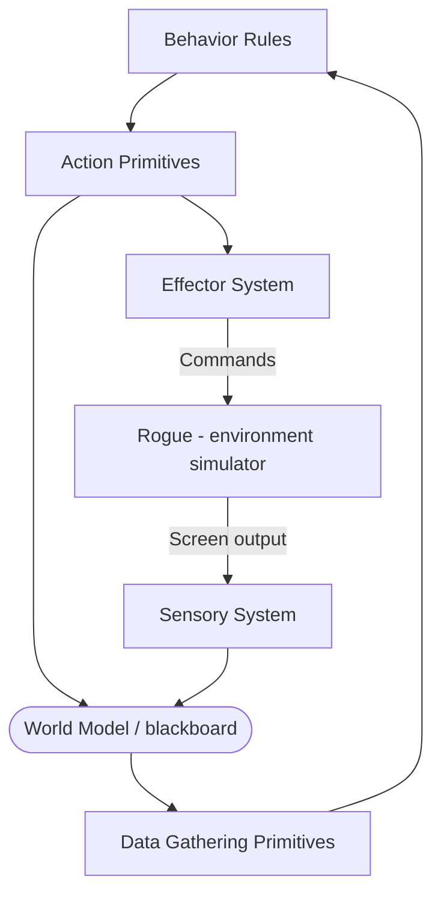

# Rog-O-Matic: A Belligerent Expert System — Summary

> [!NOTE]
> **Source:** [mauldin-rogomatic.pdf](../../sources/software-engineering/mauldin-rogomatic.pdf) · Mauldin, M. L., Jacobson, G., Appel, A. W., & Hamey, L. G. C., 1983 · Technical report CMU-CS-83-144, Department of Computer Science, Carnegie-Mellon University, July 8, 1983 · [KiltHub record](https://kilthub.cmu.edu/articles/journal_contribution/Rog-O-Matic_a_belligerent_expert_system/6609137/1).
> Study-guide summary of the full document. See the original for exact wording and figures.
> (The 1983 title page prints the fourth author as "Leonard Harney"; the correct surname is **Hamey**.)

## Abstract

A CMU technical report describing Rog-O-Matic, an expert system that plays the computer game Rogue autonomously — combining fast algorithmic knowledge sources with statically ordered heuristic production rules, cooperating through a Hearsay-II-style blackboard, to explore a hostile, randomised, partially observable environment.

**Key points**

- **Started October 1981** as "a simple project" at CMU; it grew into a 12,000-line C expert system (Rogue itself is 8,900 lines) running on a VAX 11/780 under Berkeley Unix.
- **Hybrid architecture:** algorithmic knowledge sources (terrain map, object map, inventory, path calculator, connectivity analyser, internal-state tracker) where uncertainty is low; heuristic production rules grouped into ~11 statically ordered "experts" (melee, battlestations, retreat, explore, …) where uncertainty is high; both interact through a blackboard world model.
- **Why an expert system:** search is intractable in Rogue — up to 500 possible actions at any moment, each with several thousand possible next states; adversary probabilities are unknown and change game to game.
- **It beat the humans:** over January 1 – February 21, 1983, Rog-O-Matic played 106 games of Rogue 5.2 on CMU's GP-Vax and achieved the **highest median score of any player** in a plot of the 16 best players at CMU (15 humans plus Rog-O-Matic), staying on the Rogue "Top Ten" most of that time. Since February 1983 its median rose to 1400 (10th-percentile score 3950); its best game scored **7730**, in which it **found the Amulet of Yendor** and died carrying it back to the surface.
- **Development method:** trial and error against the score — watch hundreds of logged games, add an expert, keep it only if score and deepest penetration improved. The explore expert was completely rewritten four times, once by each author.
- **Known problems:** static rule ordering copes poorly with the changing nature of deeper levels (e.g. Invisible Stalker precautions must be smeared across many rules), and single-mindedness — one action can't serve multiple goals, which "fails miserably" against multiple monsters.

**Takeaways**

- An early (1981–83) demonstration that a hybrid of conventional algorithms and rule-based heuristics could outperform expert humans at a dynamic, adversarial, partially observable task — unlike the static domains of classic expert systems.
- The engineering lessons are recognisably modern: a shared world model as the integration point, cheap-to-compute knowledge wherever possible, heuristics only where needed, and empirical, score-driven iteration with detailed logs as the development loop.
- Grounds the claim that Rog-O-Matic was built at CMU starting in 1981 and beat top human Rogue players by early 1983.

## 1. Introduction

- Rog-O-Matic plays **Rogue**, whose object is to explore and survive a complex, hostile environment — an instance of what the authors call an **exploration task** (formally: given an undirected planar graph, a start node, and a visibility function, traverse edges so as to see all nodes, minimising nodes visited).
- **Why Rogue as the terrain generator:** it is a pre-existing game designed for human play; it has an objective scalar performance measure (the score); and there is an abundance of human volunteers to calibrate that measure.
- **Why planning is hard here:** the task is complicated by adversaries whose goal is to stop the explorer reaching the lower levels. Carbonell's adversary-planning work assumes more structure; expected-value search trees (Berliner's backgammon program) need known transition probabilities, but in Rogue the probabilities are unknown to the player and change game to game; scenario-based combat analysis (Wall & Rissland) breaks down when unseen opponents can appear at any time with unknown parameters.
- **Why an expert system:** search is intractable — as many as **500 possible actions** at any one time, each with **several thousand possible next states**.
- Rog-O-Matic differs from other expert systems in four ways:
  - it solves a **dynamic** problem rather than a static one;
  - it plans **against adversaries**;
  - it plays a game where some events are **determined randomly**;
  - it plays despite **limited information**.
- The Rog-O-Matic source was publicly available via FTP over the ARPAnet (useful mainly at Unix sites).

## 2. The Rogue Environment

- The environment is a cave of levels; each level has six to nine rectangular rooms connected by tunnels. The player is an explorer searching for gold and fighting the monsters guarding the cave; magic items (potions, weapons) are scattered about, and hidden traps punish careless players.
- **Figure 2-1** shows a real screen from a Rog-O-Matic game against Rogue 5.2: the program is the `@` sign, facing a `U` (an Umber Hulk) that is about to force it to quit rather than face certain death; the status line reads Level 25, Gold 7730, Hp 25(77), Str 15(16), Ac −2, Exp 13/30668.
- **The object of the game** is to reach the 26th level and retrieve the **Amulet of Yendor**. Deeper levels have more gold but harder monsters; on average monsters increase in ferocity faster than the player's skill grows, so reaching level 26 is almost impossible.
- **Scoring:** the score is the gold obtained, with bonuses for retrieving the Amulet. Being killed costs ten percent of the gold — so it is sometimes better to quit than fight "to the death".

## 3. The Expert System Architecture

> [!IMPORTANT]
> Rog-O-Matic is a combination of **algorithmic knowledge sources** and **production rules**: where uncertainty is low, algorithmic methods compute relevant information fast; where uncertainty is high, heuristic production rules provide reasonable behaviour. The two interact through a **world model similar to the blackboard of Hearsay-II**. Because the system is written in an imperative language, the rules are **statically ordered** — dynamic ordering would have been much harder to code.

**System architecture (Figure 3-1).** Rog-O-Matic plays by intercepting characters from the terminal stream and sending command characters back to the Rogue process. The **sensory module** converts the CRT-drawing character stream into a world-state representation (the hard direction); the **effector module** converts motion/action directives into Rogue commands (the easy direction, included mainly for symmetry, citing Langley et al. on simple sensory/effector interfaces).

- Most modules take low-level data from the world model and process it into higher-level information until the rules can operate on it directly. Action primitives can also write to the world model, letting production rules encode inference; short-term memory is a portion of the world model holding internal state.

**Knowledge sources** (partial list, Figure 3-2 boxes):

| Knowledge source | Name | Role |
|---|---|---|
| Sensory system | `sense` | Builds low-level data structures from Rogue output |
| Object map | `objmap` | Tracks location and history of objects (weapons, monsters) |
| Inventory handler | `invent` | Database of items in Rog-O-Matic's pack |
| Terrain map | `termap` | Records terrain features of the current level |
| Connectivity analyzer | `connect` | Finds cycles of rooms (loops) |
| Path calculation | `pathc` | Weighted shortest-path calculations |
| Internal state recognizer | `intern` | Tracks Rog-O-Matic's health and combat status |

**Experts.** Rules are grouped hierarchically into experts, each handling a related set of tasks, **statically ordered in rough order of contribution to survivability** — e.g. the melee expert's decision to dispatch a monster overrides the object-acquisition expert's call to pick something up. The structure resembles a **directed acyclic graph (DAG) of IF-THEN-ELSE rules** (Figure 3-2 shows experts as ovals drawing on knowledge-source boxes).

| Expert | Name | Role |
|---|---|---|
| Weapon handler | `weapon` | Chooses weapon to wield |
| Melee expert | `melee` | Controls fighting during combat |
| Target acquisition | `target` | Controls pursuit of targets |
| Missile fire | `missile` | Fires missiles (arrows, spears, rocks) at distant targets |
| Battlestations | `battle` | Performs special attacks, initiates retreat |
| Retreat expert | `retreat` | Uses terrain map + connectivity analysis to pick a retreat path |
| Object acquisition | `object` | Picks up objects |
| Armor handler | `armor` | Chooses armor to wear |
| Magic item handlers | `magic` | Manipulates magic items |
| Health maintenance | `health` | Eats when hungry, rests to heal |
| Exploration expert | `explore` | Chooses next place to explore, controls movement |

- **Static ordering: costs and benefits.** The authors consider static ordering a drawback (section 6), but it gives ease of coding and **prevention of looping**: dynamically reordered rules can make a system oscillate between two courses of action (in Rogue 5.2 the player would starve to death — analogous to chess programs drawn via the three-move rule). Static rules make it feasible to reason about the code and verify loop absence: show each expert makes progress toward its own goals, and each goal is abandoned only for a higher-priority goal.
- **The path calculator** (`pathc`) is the most interesting algorithmic knowledge source: it reads the terrain map and finds weighted shortest paths to the nearest location meeting given criteria (nearest unknown object, nearest escape route). Edge costs are small bounded integers encoding known or possible dangers (traps, unexplored squares); a breadth-first search decrements non-zero avoidance values and re-queues squares, yielding a weighted shortest path in **time linear in the number of terrain squares**. Since the system spends most of its time moving, a fast path calculator is essential.
- **The connectivity analyzer** (`connect`) does a depth-first search of the terrain to detect corridor loops, a resource for the retreat expert. Because the Rogue player heals while most monsters do not, any monster can be defeated regardless of strength if the player can retreat far enough while healing — **connect + retreat contribute heavily to Rog-O-Matic's success**.
- **Sample rules (Figure 3-3),** from the battlestations expert, which melee invokes with key battle parameters (monster strength, turns to reach the player, direction) posted on the blackboard. Battlestations decides: attack with the current weapon, attack with a special magic item, or retreat. The published examples (C code with comment glosses):
  1. **Retreat** — IF not confused AND the monster is not a fungus (which can hold us) AND we could die in one melee round AND the retreat expert finds a retreating move THEN retreat (displaying "Run away! Run away!").
  2. **Teleport the monster** — IF we could die in one melee round AND we have line of sight AND the monster is adjacent AND we have a wand of "teleport away" THEN point the wand at the monster.
  3. **Teleport ourselves** — IF we could die in one melee round AND the monster is adjacent AND we have a scroll of teleportation THEN read the scroll.

## 4. Implementation

- Runs on a **VAX 11/780 under Berkeley Unix**; **12,000 lines of C** (versus 8,900 lines of C for Rogue itself). C was chosen for **convenience** (direct access to the OS primitives needed to interface to Rogue without modifying the game) and **speed** (much faster than most production-system languages — necessary to play enough games to measure performance).
- Costs about **30 CPU seconds (~400 actions) per level**, with Rogue adding ~15 CPU seconds for its side of the simulation. By the time of writing, Rog-O-Matic had played **more than 5,000 games**.
- **Rog-O-Matic was started in October of 1981 as a simple project** with little initial thought to AI techniques; as the Rogue task became better understood, more subproblems demanding search or heuristics emerged, and the authors "eventually realized that the Rog-O-Matic program had become a large, competent expert system."
- **Growth history (Figure 4-1)** — knowledge sources and experts added over time, with the approximate 10th-percentile score after each wave (each part was also under continual improvement; the `explore` expert was completely rewritten four times, once by each author):

| Date | Knowledge sources added | Experts added | ~10th-percentile score |
|---|---|---|---|
| Dec-81 | termap, objmap, intern | target | ~1000 |
| Mar-82 | pathc, invent | explore | ~1500 |
| Apr-82 | — | object, health, magic, melee | ~2000 |
| May-82 | connect | retreat | ~3000 |
| Nov-82 | — | weapon, missile, armor | ~3500 |
| Jul-83 | *with subsequent improvements* | | ~4000 |

- **Development methodology:** initial experts were designed from the authors' own Rogue knowledge; later modules by **trial and error**. Each version was watched over hundreds of games; human observations and game-log analysis flagged situations lacking sophistication (often expert comparisons of the form *"When I'm in that situation, I generally…"*). A new expert was retained only if performance — measured by **both score and deepest penetration** — improved over the previous version. This worked because the score was an obvious performance measure and a detailed log recorded every Rog-O-Matic/Rogue interaction.

## 5. Performance

> [!IMPORTANT]
> Rog-O-Matic plays as well as human experts, and is particularly good at playing out marginal games that humans often abandon. In **106 games** from **January 1 to February 21, 1983** against Rogue 5.2 on CMU's GP-Vax, it achieved **the highest median score of any player** among the 16 best Rogue players at CMU (15 humans + Rog-O-Matic), and was on the Rogue *Top Ten* (the ten highest scorers) for most of that period.

- **Figure 5-1** is a box-and-whisker plot (log-scale score vs. player, sorted by median): boxes span lower to upper quartile with a line at the median, whiskers at the 10th and 90th percentiles, extreme games as asterisks. Only players with ten or more games against Rogue 5.2 on the GP-Vax are included; "RGM" (Rog-O-Matic) sits rightmost — the top median.
- **Since February 1983:** median score up to **1400**, 10th-percentile score **3950**.
- **Best game:** the highest score obtained against Rogue 5.2 so far is **7730** — a game in which Rog-O-Matic **had found the Amulet** and was defeated while returning it to the surface (the final position is the screen in Figure 2-1).

## 6. Problems

- **Static rule ordering vs. a changing task.** As the explorer goes deeper, new dangers appear, each needing extra rules with slightly different activation conditions. Dynamic ordering might achieve the same effect with fewer rules, grouped readably. Example: **Invisible Stalkers** on levels 16–25 require special precautions when resting, and that knowledge must be **spread across all affected rules** rather than grouped into one set of "invisible monster strategies".
- **Single-mindedness.** Rog-O-Matic never considers that a single action might satisfy multiple goals — e.g. it won't pick up objects that lie on its escape route while fleeing. Sometimes a secondary factor demands more creative action than static ordering can produce. The problem is **most severe against multiple monsters**: the heuristic is to fight the meanest monster first, and in some situations that rule "fails miserably" — which in Rogue usually means death.

## 7. Conclusion and Future Work

- Combining efficient algorithmic knowledge sources with rule-based control produced a program **demonstrably expert at Rogue**: it performs exploration tasks while preserving itself, functions under uncertain dangers, makes considered fight-or-flight decisions, and retreats successfully from overwhelming opposition — with high median scores and months as a regular on CMU's Rogue Top Ten.
- Encoding Rogue knowledge procedurally let the authors test many tactics and strategies, raising scores for Rog-O-Matic **and for several of the humans who helped develop it**.
- Further improvement is getting harder — both because of Rog-O-Matic's growing complexity and because the obvious strategies are nearly exhausted. The hope is a **statistical learning module** (being implemented by Leonard Hamey) to select automatically between programmer-proposed tactics, so the program shoulders part of the burden of improving its own play.

## 8. Acknowledgements

- Thanks to the Rog-O-Matic user communities at **CMU and Rice University** for thousands of hours of testing; named observers (Murray Campbell, Mary Shaw, and others) for documented debugging observations; named players for human-performance data; Jaime Carbonell and Dave Touretzky for criticism of drafts; and **Ken Arnold and Michael Toy** for creating "a very interesting (and very, very hostile) environment".

## 9. References

Seven references, notably: Berliner's BKG backgammon program (IJCAI 1977); Carbonell's counterplanning (AIJ 1981); Erman, Hayes-Roth, Lesser & Reddy's **Hearsay-II** (Computing Surveys 1980); Kernighan & Ritchie's *The C Programming Language* (1978); Langley et al. on simulated worlds for learning (Cognitive Science Society 1981); Toy & Arnold's Rogue guide *A Guide to the Dungeons of Doom*; Wall & Rissland on scenarios in planning (AAAI 1982).
